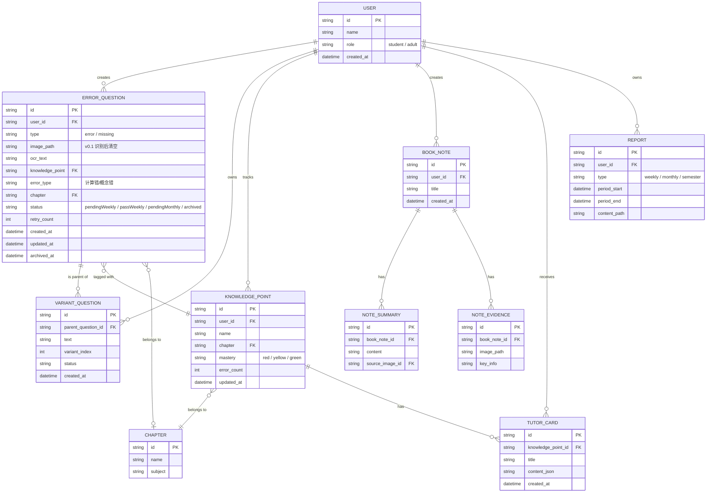

# 数据模型设计 — AI智能学习机 v0.1

> **文档版本**：v0.1.0  
> **编制日期**：2026-06-06  
> **前置依赖**：`docs/design/系统架构设计.md`  
> **目标**：30 条需求全考虑的完整数据模型（含 v0.2 / v0.3 预留）

---

## 1. 实体关系总览（30 条需求全考虑）



---

## 2. 完整数据表（30 条需求全考虑）

### 2.1 users（用户表）

| 字段 | 类型 | 约束 | 说明 |
|:-----|:-----|:-----|:-----|
| `id` | TEXT | PRIMARY KEY | UUID v4 |
| `name` | TEXT | NOT NULL | 显示名（"公子"/"儿子"）|
| `role` | TEXT | NOT NULL | `'student'` / `'adult'` |
| `created_at` | INTEGER | NOT NULL | Unix 时间戳 |
| `last_active_at` | INTEGER | | 最近活跃时间 |

**v0.1 实现**：✅
**v0.2 实现**：✅
**v0.3 实现**：✅

**SQL**：
```sql
CREATE TABLE users (
  id TEXT PRIMARY KEY,
  name TEXT NOT NULL,
  role TEXT NOT NULL CHECK (role IN ('student', 'adult')),
  created_at INTEGER NOT NULL,
  last_active_at INTEGER
);

CREATE INDEX idx_users_role ON users(role);
```

---

### 2.2 error_questions（错题/漏题表）

| 字段 | 类型 | 约束 | 说明 |
|:-----|:-----|:-----|:-----|
| `id` | TEXT | PRIMARY KEY | UUID |
| `user_id` | TEXT | NOT NULL, FK → users.id | 所属用户 |
| `type` | TEXT | NOT NULL | `'error'` / `'missing'` |
| `image_path` | TEXT | | 本地图片路径（v0.1 默认识别后清空）|
| `ocr_text` | TEXT | NOT NULL | OCR 识别后文本 |
| `ocr_latex` | TEXT | | 数学公式 LaTeX（如果有）|
| `knowledge_point` | TEXT | FK → knowledge_points.id | AI 打标 |
| `error_type` | TEXT | | `'计算错'` / `'概念错'` / `'审题错'` / `'跳题'` |
| `chapter` | TEXT | FK → chapters.id | 教材章节 |
| `status` | TEXT | NOT NULL | `'pendingWeekly'` / `'passWeekly'` / `'pendingMonthly'` / `'archived'` |
| `retry_count` | INTEGER | DEFAULT 0 | 周测重试次数 |
| `created_at` | INTEGER | NOT NULL | 入库时间 |
| `updated_at` | INTEGER | NOT NULL | 状态变更时间 |
| `archived_at` | INTEGER | | 归档时间 |

**v0.1 实现**：✅
**v0.2 实现**：✅
**v0.3 实现**：✅

**SQL**：
```sql
CREATE TABLE error_questions (
  id TEXT PRIMARY KEY,
  user_id TEXT NOT NULL,
  type TEXT NOT NULL CHECK (type IN ('error', 'missing')),
  image_path TEXT,
  ocr_text TEXT NOT NULL,
  ocr_latex TEXT,
  knowledge_point TEXT,
  error_type TEXT,
  chapter TEXT,
  status TEXT NOT NULL CHECK (status IN ('pendingWeekly', 'passWeekly', 'pendingMonthly', 'archived')),
  retry_count INTEGER DEFAULT 0,
  created_at INTEGER NOT NULL,
  updated_at INTEGER NOT NULL,
  archived_at INTEGER,
  FOREIGN KEY (user_id) REFERENCES users(id) ON DELETE CASCADE
);

CREATE INDEX idx_eq_user_status ON error_questions(user_id, status);
CREATE INDEX idx_eq_user_type ON error_questions(user_id, type);
CREATE INDEX idx_eq_kp ON error_questions(knowledge_point);
```

**v0.1 关键查询**（带 user_id 强制过滤）：
```sql
-- 查本周错题池
SELECT * FROM error_questions
WHERE user_id = ?
  AND status = 'pendingWeekly'
  AND type = 'error'
  AND created_at > ?  -- 本周一 00:00
ORDER BY created_at DESC;

-- 查某知识点的所有错题
SELECT * FROM error_questions
WHERE user_id = ?
  AND knowledge_point = ?
ORDER BY created_at DESC;
```

---

### 2.3 variant_questions（变式题表）

| 字段 | 类型 | 约束 | 说明 |
|:-----|:-----|:-----|:-----|
| `id` | TEXT | PRIMARY KEY | UUID |
| `parent_question_id` | TEXT | NOT NULL, FK → error_questions.id | 关联原题 |
| `text` | TEXT | NOT NULL | 变式题文本 |
| `latex` | TEXT | | 数学公式 LaTeX |
| `variant_index` | INTEGER | NOT NULL | 1 / 2 / 3（默认 3 道）|
| `status` | TEXT | NOT NULL | `'pendingWeekly'` / `'passWeekly'` / `'archived'` |
| `created_at` | INTEGER | NOT NULL | |

**v0.1 实现**：✅（存库 + 状态机）
**v0.2 实现**：✅（完整 UI）
**v0.3 实现**：✅

**SQL**：
```sql
CREATE TABLE variant_questions (
  id TEXT PRIMARY KEY,
  parent_question_id TEXT NOT NULL,
  text TEXT NOT NULL,
  latex TEXT,
  variant_index INTEGER NOT NULL CHECK (variant_index IN (1, 2, 3)),
  status TEXT NOT NULL,
  created_at INTEGER NOT NULL,
  FOREIGN KEY (parent_question_id) REFERENCES error_questions(id) ON DELETE CASCADE
);

CREATE INDEX idx_vq_parent ON variant_questions(parent_question_id);
CREATE INDEX idx_vq_status ON variant_questions(status);
```

---

### 2.4 knowledge_points（知识点表）

| 字段 | 类型 | 约束 | 说明 |
|:-----|:-----|:-----|:-----|
| `id` | TEXT | PRIMARY KEY | UUID |
| `user_id` | TEXT | NOT NULL, FK → users.id | 所属用户 |
| `name` | TEXT | NOT NULL | "异分母加减法" |
| `chapter` | TEXT | FK → chapters.id | 所属章节 |
| `mastery` | TEXT | NOT NULL | `'red'` / `'yellow'` / `'green'` |
| `error_count` | INTEGER | DEFAULT 0 | 该知识点错题数 |
| `last_error_at` | INTEGER | | 最近错题时间 |
| `updated_at` | INTEGER | NOT NULL | |

**v0.1 实现**：✅（彩虹图渲染需要）
**v0.2 实现**：✅
**v0.3 实现**：✅

**SQL**：
```sql
CREATE TABLE knowledge_points (
  id TEXT PRIMARY KEY,
  user_id TEXT NOT NULL,
  name TEXT NOT NULL,
  chapter TEXT,
  mastery TEXT NOT NULL CHECK (mastery IN ('red', 'yellow', 'green')),
  error_count INTEGER DEFAULT 0,
  last_error_at INTEGER,
  updated_at INTEGER NOT NULL,
  FOREIGN KEY (user_id) REFERENCES users(id) ON DELETE CASCADE,
  UNIQUE (user_id, name, chapter)
);

CREATE INDEX idx_kp_user_mastery ON knowledge_points(user_id, mastery);
```

**mastery 颜色规则**（业务逻辑）：

| 颜色 | 条件 |
|:-----|:-----|
| 🔴 红色 (未掌握) | 有错题在 pendingWeekly 循环里 |
| 🟡 黄色 (不稳定) | 错题已通过周测，正在月观察期 (passWeekly 或 pendingMonthly) |
| 🟢 绿色 (已掌握) | 本月所有错题已通过月测归档 (archived) |

---

### 2.5 chapters（教材章节表）

| 字段 | 类型 | 约束 | 说明 |
|:-----|:-----|:-----|:-----|
| `id` | TEXT | PRIMARY KEY | UUID |
| `name` | TEXT | NOT NULL | "分数运算" |
| `subject` | TEXT | NOT NULL | "数学" / "语文" / "英语" |
| `parent_id` | TEXT | FK → chapters.id | 上级章节（树形）|
| `order` | INTEGER | | 排序 |

**v0.1 实现**：✅（打标用，但章节数据需初始化）
**v0.2 实现**：✅
**v0.3 实现**：✅

**SQL**：
```sql
CREATE TABLE chapters (
  id TEXT PRIMARY KEY,
  name TEXT NOT NULL,
  subject TEXT NOT NULL,
  parent_id TEXT,
  display_order INTEGER,
  FOREIGN KEY (parent_id) REFERENCES chapters(id)
);
```

**预置数据**（v0.1 启动时初始化小学数学章节，50+ 章节，json 资源文件）：

```json
// assets/chapters/math_elementary.json
[
  {"id": "math-1", "subject": "数学", "name": "数的认识", "parent_id": null, "order": 1},
  {"id": "math-1-1", "subject": "数学", "name": "10 以内加减", "parent_id": "math-1", "order": 1},
  {"id": "math-1-2", "subject": "数学", "name": "20 以内进位加", "parent_id": "math-1", "order": 2},
  ...
]
```

---

### 2.6 book_notes（读书笔记表，v0.2 推）

| 字段 | 类型 | 约束 | 说明 |
|:-----|:-----|:-----|:-----|
| `id` | TEXT | PRIMARY KEY | UUID |
| `user_id` | TEXT | NOT NULL, FK → users.id | |
| `title` | TEXT | | 笔记标题（AI 生成或手填）|
| `cover_image_path` | TEXT | | 封面图（可空）|
| `created_at` | INTEGER | NOT NULL | |
| `updated_at` | INTEGER | NOT NULL | |

**v0.1 实现**：❌（不开发）
**v0.2 实现**：✅
**v0.3 实现**：✅

---

### 2.7 note_summaries（笔记摘要表，v0.2 推）

| 字段 | 类型 | 约束 | 说明 |
|:-----|:-----|:-----|:-----|
| `id` | TEXT | PRIMARY KEY | UUID |
| `book_note_id` | TEXT | NOT NULL, FK → book_notes.id | |
| `content` | TEXT | NOT NULL | AI 摘要内容 |
| `source_image_id` | TEXT | FK → note_evidences.id | 关联原图 |
| `created_at` | INTEGER | NOT NULL | |

---

### 2.8 note_evidences（笔记存证图，v0.2 推）

| 字段 | 类型 | 约束 | 说明 |
|:-----|:-----|:-----|:-----|
| `id` | TEXT | PRIMARY KEY | UUID |
| `book_note_id` | TEXT | NOT NULL, FK → book_notes.id | |
| `image_path` | TEXT | NOT NULL | 原图路径 |
| `key_info` | TEXT | | AI 提取的关键信息 |
| `created_at` | INTEGER | NOT NULL | |

---

### 2.9 tutor_cards（AI 私教讲解卡，v0.2 推）

| 字段 | 类型 | 约束 | 说明 |
|:-----|:-----|:-----|:-----|
| `id` | TEXT | PRIMARY KEY | UUID |
| `knowledge_point_id` | TEXT | NOT NULL, FK → knowledge_points.id | |
| `title` | TEXT | NOT NULL | 讲解卡标题 |
| `content_json` | TEXT | NOT NULL | 讲解内容（JSON 含核心定义/公式/例题/易错点）|
| `created_at` | INTEGER | NOT NULL | |

---

### 2.10 reports（学情报告，v0.2 推）

| 字段 | 类型 | 约束 | 说明 |
|:-----|:-----|:-----|:-----|
| `id` | TEXT | PRIMARY KEY | UUID |
| `user_id` | TEXT | NOT NULL, FK → users.id | |
| `type` | TEXT | NOT NULL | `'weekly'` / `'monthly'` / `'semester'` |
| `period_start` | INTEGER | NOT NULL | |
| `period_end` | INTEGER | NOT NULL | |
| `content_path` | TEXT | | 报告文件路径（PDF / Markdown）|
| `created_at` | INTEGER | NOT NULL | |

---

### 2.11 weekly_tests（周测记录表，v0.1 推）

| 字段 | 类型 | 约束 | 说明 |
|:-----|:-----|:-----|:-----|
| `id` | TEXT | PRIMARY KEY | UUID |
| `user_id` | TEXT | NOT NULL, FK → users.id | |
| `week_start` | INTEGER | NOT NULL | 本周开始时间 |
| `question_ids` | TEXT | NOT NULL | JSON 数组：抽中的题 ID |
| `completed_at` | INTEGER | | 完成时间 |
| `correct_count` | INTEGER | | 答对数 |

**v0.1 实现**：✅（最小化：只存 id + 抽题 + 完成时间）
**v0.2 实现**：✅

---

### 2.12 ocr_cache（OCR 结果缓存表，v0.1 推）

| 字段 | 类型 | 约束 | 说明 |
|:-----|:-----|:-----|:-----|
| `id` | TEXT | PRIMARY KEY | UUID |
| `image_hash` | TEXT | NOT NULL | 图片 SHA256 |
| `ocr_result_json` | TEXT | NOT NULL | OCR 识别结果 |
| `created_at` | INTEGER | NOT NULL | |

**v0.1 实现**：✅（v0.1 不做图片缓存，但缓存 OCR 结果减少重复调用）

---

### 2.13 ai_call_logs（AI 调用日志表，v0.1 推）

| 字段 | 类型 | 约束 | 说明 |
|:-----|:-----|:-----|:-----|
| `id` | TEXT | PRIMARY KEY | UUID |
| `user_id` | TEXT | NOT NULL | |
| `provider` | TEXT | NOT NULL | 'deepseek' / 'baidu_edu' |
| `purpose` | TEXT | NOT NULL | 'tagging' / 'variant' / 'summarize' / 'notes' |
| `prompt_tokens` | INTEGER | | |
| `completion_tokens` | INTEGER | | |
| `total_tokens` | INTEGER | | |
| `cost_cents` | INTEGER | | 成本（分）|
| `latency_ms` | INTEGER | | 延迟 |
| `success` | INTEGER | NOT NULL | 0 / 1 |
| `error_msg` | TEXT | | 失败原因 |
| `created_at` | INTEGER | NOT NULL | |

**v0.1 实现**：✅（监控 token 花费和延迟）

---

## 3. 数据隔离设计

### 3.1 隔离层级

| 层级 | 机制 | 强制方式 |
|:-----|:-----|:---------|
| UI | Riverpod 注入 userId | UI 拿不到跨用户数据 |
| 业务 | Repository 方法签名带 userId | 编译时检查（强制参数）|
| 数据 | SQL `WHERE user_id = ?` | 自动化测试覆盖 |
| 抽象层 | 无关 | - |

### 3.2 测试覆盖

- ✅ 单元测试：所有 Repo 方法测"用 A 用户 ID 查不出 B 用户数据"
- ✅ 集成测试：登录 A → 看不到 B 的题 / 笔记 / 报告
- ✅ 端到端：多用户切换数据 0 串

---

## 4. 数据迁移策略

### 4.1 sqflite 迁移

```dart
// lib/core/data/database.dart
class AppDatabase {
  static const _dbVersion = 1;  // v0.1
  static const _tables = [
    'users', 'error_questions', 'variant_questions',
    'knowledge_points', 'chapters', 'book_notes',
    'note_summaries', 'note_evidences', 'tutor_cards',
    'reports', 'weekly_tests', 'ocr_cache', 'ai_call_logs',
  ];
  
  static Future<Database> open() async {
    return openDatabase(
      'ai_smart_learner.db',
      version: _dbVersion,
      onCreate: _onCreate,
      onUpgrade: _onUpgrade,  // 升级时执行迁移
    );
  }
  
  static Future<void> _onCreate(Database db, int version) async {
    // 批量建表
    for (final table in _tables) {
      await db.execute(_ddlForTable(table));
    }
    // 初始化预置数据（chapters）
    await _seedChapters(db);
  }
  
  static Future<void> _onUpgrade(Database db, int oldVersion, int newVersion) async {
    // 升级迁移
    if (oldVersion < 2) { /* 迁移到 v2 */ }
    if (oldVersion < 3) { /* 迁移到 v3 */ }
  }
}
```

### 4.2 预置数据加载

- 小学数学/语文/英语章节树：`assets/chapters/*.json`（50+ 章节）
- AI Prompt 模板：`assets/prompts/*.md`
- 知识图谱初始数据：`assets/knowledge/elementary_math.json`（v0.2 推）

---

## 5. 性能与存储

### 5.1 性能预算

| 指标 | 目标 | 实现 |
|:-----|:-----|:-----|
| 单查询响应 | <50ms (SQLite 本地)| 加索引 |
| 列表加载（100 条错题）| <200ms | 懒加载 + 分页 |
| 知识彩虹图渲染（200 知识点）| <500ms | fl_chart 优化 |
| 周测抽题（10 道）| <1s | 预生成 + 缓存 |
| 学期报告生成 | <10s | 异步 + 进度回调 |

### 5.2 存储预算

| 数据 | 单条大小 | 1000 条总 | 备注 |
|:-----|:---------|:----------|:-----|
| ErrorQuestion | ~1KB | 1MB | 元数据为主 |
| VariantQuestion | ~500B | 500KB | |
| KnowledgePoint | ~200B | 200KB | |
| Image（删前）| ~1MB | - | 识别后删 |
| Image（保留配置下）| ~1MB | 1GB | 用户配"保留 30 天" |
| 报告 PDF | ~500KB | 5MB | v0.2+ |

**总占用**（1000 错题 + 100 知识点 + 1 月报告）≈ 5MB（不含图片）

---

## 6. 数据备份与恢复（v0.3 推）

| 维度 | v0.1 | v0.2 | v0.3 |
|:-----|:-----|:-----|:-----|
| iCloud 备份 | ❌ | ❌ | ✅（自动）|
| 本地导出 SQLite | ❌ | ❌ | ✅（用户手动）|
| 跨设备同步 | ❌ | ❌ | ✅（iCloud Drive）|
| 加密备份 | ❌ | ❌ | ✅（Keychain 加密）|

**v0.1 不做**：用户自用、数据丢失风险可控（不是企业级数据）

---

## 7. 自查报告

| 自查项 | 结果 |
|:-----|:-----|
| 30 条需求数据全考虑 | ✅（13 张表覆盖）|
| ER 图完整 | ✅ |
| 所有表 SQL DDL | ✅ |
| 数据隔离设计 | ✅（3.x）|
| 性能预算 | ✅（5.1）|
| 存储预算 | ✅（5.2）|
| 迁移策略 | ✅（4.x）|
| 备份策略 | ✅（6）|