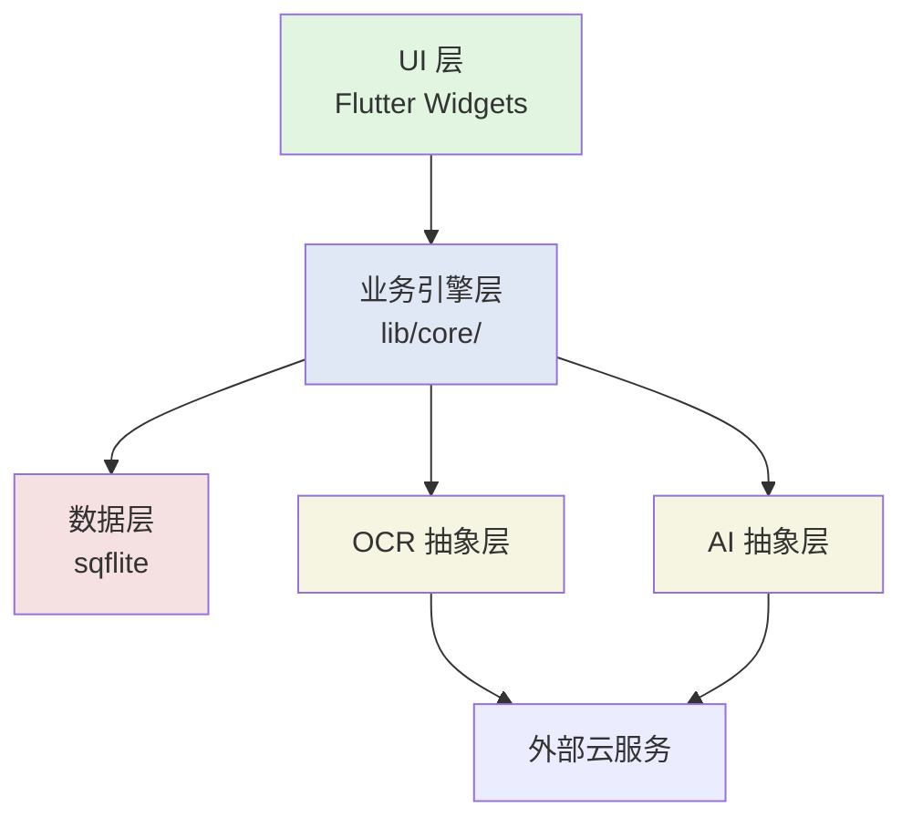

# 系统架构设计 — AI智能学习机 v0.1

> **文档版本**：v0.1.0  
> **项目名**：AI智能学习机  
> **编制日期**：2026-06-06  
> **前置依赖**：`docs/requirements/需求规格说明书.md` (Stage 1) + `docs/research/技术方案说明书.md` (Stage 2)  
> **本阶段目标**：按"通用开发原则 1：架构一次性搭好"，**全 30 条需求纳入架构**，输出可执行架构

---

## 1. 架构总览

### 1.1 分层架构

```
┌──────────────────────────────────────────────────────────────────────┐
│  UI 层 (Flutter Widgets)                                              │
│  ┌────────────────────┬────────────────────┬─────────────────────┐  │
│  │  启动选身份         │  学生界面          │  大人界面 (v0.2)     │  │
│  │  SettingsPage       │  CapturePage       │  NotesPage          │  │
│  │                    │  WeeklyTestPage    │  BookPage           │  │
│  │                    │  RainbowChartPage  │                     │  │
│  └────────────────────┴────────────────────┴─────────────────────┘  │
└──────────────────────────────────────────────────────────────────────┘
                                ↕ Riverpod Providers (DI)
┌──────────────────────────────────────────────────────────────────────┐
│  业务引擎层 (Dart, lib/core/)                                          │
│  ┌──────────────────┬──────────────────┬──────────────────────┐   │
│  │  学生引擎          │  大人引擎 (v0.2)  │  共享引擎             │   │
│  │  - state_machine  │  - notes_gen     │  - auth/user_id      │   │
│  │  - weekly_pool    │  - summarize     │  - scheduler (cron)  │   │
│  │  - scheduler      │  - export        │  - notifications     │   │
│  │  - variant_gen    │                  │  - config_loader     │   │
│  │  - knowledge_graph│                  │                      │   │
│  └──────────────────┴──────────────────┴──────────────────────┘   │
│  ┌──────────────────┬──────────────────┬──────────────────────┐   │
│  │  数据层            │  OCR 抽象层       │  AI 抽象层            │   │
│  │  - sqflite DB     │  - OCRProvider   │  - AIProvider        │   │
│  │  - models         │  - BaiduEdu      │  - DeepSeek          │   │
│  │  - repositories   │  - Mathpix (v0.2)│  - Claude (v0.2)    │   │
│  │                  │  - AppleVision    │  - GPT-4 (v0.2)     │   │
│  └──────────────────┴──────────────────┴──────────────────────┘   │
└──────────────────────────────────────────────────────────────────────┘
                                ↕ SQL + HTTP
┌──────────────────────────────────────────────────────────────────────┐
│  外部服务 (云)                                                          │
│  - 百度云 OCR 教育版 (默认)                                              │
│  - DeepSeek API (默认)                                                │
│  - (v0.2+) Mathpix / Apple Vision / GPT-4 / Claude                     │
└──────────────────────────────────────────────────────────────────────┘
                                ↕ 本地文件
┌──────────────────────────────────────────────────────────────────────┐
│  本地资源                                                               │
│  - SQLite 数据库文件                                                    │
│  - 拍照图片缓存 (识别后默认删)                                             │
│  - Keychain (API Key)                                                  │
│  - iOS 沙盒 (导出文件)                                                  │
└──────────────────────────────────────────────────────────────────────┘
```

### 1.2 核心设计原则

| 原则 | 实现 |
|:-----|:-----|
| **架构一次性搭好** | 30 条需求全进架构（v0.1 + v0.2 + v0.3），后续不返工 |
| **业务/UI 解耦** | UI 层只调 Riverpod Provider，Provider 调业务层，业务层调数据/抽象层 |
| **OCR/AI 可插拔** | 抽象层接口稳定，实现类可热切换 |
| **数据隔离** | user_id 强制过滤，所有查询走 Repository 层 |
| **状态机驱动** | 错题/漏题生命周期由显式状态机管理 |
| **离线优先** | 本地 SQLite 是真相源，云端 API 是补充 |
| **隐私** | 图片默认识别后删，OCR 调云 stateless |

### 1.3 模块依赖图



---

## 2. 详细模块设计

### 2.1 UI 层 (lib/ui/)

| 模块 | v0.1 页面 | v0.2 页面 | v0.3 页面 |
|:-----|:---------|:---------|:---------|
| **共享** | UserSelectPage, SettingsPage | - | - |
| **学生** | HomePage, CapturePage, WeeklyTestPage, WeeklyPoolPage, RainbowChartPage, ArchivePage | KnowledgeGraphPage, MonthlyTestPage, ReportPage, LifeCycleMapPage, VariantPage | HeatMapPage, PaintPage, OfflinePage |
| **大人** | (无) | NotesPage, BookPage, SummaryPage, ExportPage | - |

### 2.2 业务引擎层 (lib/core/)

#### 学生模块 (lib/core/students/)

| 组件 | 职责 | v0.1 | v0.2 | v0.3 |
|:-----|:-----|:-----|:-----|:-----|
| `state_machine.dart` | 错题状态机 | ✅ | ✅ | ✅ |
| `weekly_pool.dart` | 周题池管理 | ✅ | ✅ | ✅ |
| `monthly_pool.dart` | 月观察池 | ❌ | ✅ | ✅ |
| `capture.dart` | 拍照录入流程 | ✅ | ✅ | ✅ |
| `variant_gen.dart` | 变式题生成 | ✅ | ✅ | ✅ |
| `monthly_test.dart` | 月测流程 | ❌ | ✅ | ✅ |
| `archive.dart` | 学期归档 | ❌ | ✅ | ✅ |
| `knowledge_graph.dart` | 知识图谱构建 | ❌ | ✅ | ✅ |
| `tutor.dart` | AI 私教讲解 | ❌ | ✅ | ✅ |
| `tagging.dart` | 智能打标 | ✅ | ✅ | ✅ |
| `paint.dart` | 圈画交互 | ❌ | ❌ | ✅ |
| `offline.dart` | 离线暂存 | ❌ | ❌ | ✅ |

#### 大人模块 (lib/core/adults/) — v0.2 推

| 组件 | 职责 | v0.1 | v0.2 | v0.3 |
|:-----|:-----|:-----|:-----|:-----|
| `notes_gen.dart` | 读书笔记生成 | ❌ | ✅ | ✅ |
| `summarize.dart` | 摘要提取 | ❌ | ✅ | ✅ |
| `book.dart` | 拍书录入 | ❌ | ✅ | ✅ |
| `export.dart` | 笔记导出 | ❌ | ✅ | ✅ |

#### 共享模块 (lib/core/)

| 组件 | 职责 | v0.1 | v0.2 | v0.3 |
|:-----|:-----|:-----|:-----|:-----|
| `auth/user_switcher.dart` | 启动选身份 + 切换 | ✅ | ✅ | ✅ |
| `auth/workspace.dart` | user_id 隔离 | ✅ | ✅ | ✅ |
| `scheduler/cron.dart` | 周末/月末调度 | ✅ | ✅ | ✅ |
| `scheduler/notifications.dart` | iOS 通知 | ✅ | ✅ | ✅ |
| `config/loader.dart` | YAML 路由配置加载 | ✅ | ✅ | ✅ |
| `config/ocr_routing.yaml` | OCR 路由配置 | ✅ | ✅ | ✅ |
| `config/ai_routing.yaml` | AI 路由配置 | ✅ | ✅ | ✅ |

### 2.3 数据层 (lib/core/data/)

| 组件 | 职责 |
|:-----|:-----|
| `database.dart` | sqflite 初始化 + 表创建 + 迁移 |
| `models/` | 数据模型类（User, ErrorQuestion, VariantQuestion, KnowledgePoint 等） |
| `repositories/` | 仓库模式（StudentRepo, AdultRepo, KPRepo） |

**Repository 模式**：业务层只调 Repo，Repo 强制带 user_id 过滤。

### 2.4 抽象层 (lib/core/ocr/, lib/core/ai/)

#### OCR 抽象层 (lib/core/ocr/)

| 组件 | v0.1 | v0.2 | v0.3 |
|:-----|:-----|:-----|:-----|
| `ocr_provider.dart` (接口) | ✅ | ✅ | ✅ |
| `factory.dart` | ✅ | ✅ | ✅ |
| `baidu_provider.dart` | ✅ | ✅ | ✅ |
| `mathpix_provider.dart` | ❌ | ✅ | ✅ |
| `apple_vision_provider.dart` | (fallback) | ✅ | ✅ |

#### AI 抽象层 (lib/core/ai/)

| 组件 | v0.1 | v0.2 | v0.3 |
|:-----|:-----|:-----|:-----|
| `ai_provider.dart` (接口) | ✅ | ✅ | ✅ |
| `factory.dart` | ✅ | ✅ | ✅ |
| `deepseek_provider.dart` | ✅ | ✅ | ✅ |
| `claude_provider.dart` | ❌ | ✅ | ✅ |
| `gpt4_provider.dart` | ❌ | ✅ | ✅ |
| `prompts/tagging.dart` | ✅ | ✅ | ✅ |
| `prompts/variant.dart` | ✅ | ✅ | ✅ |
| `prompts/knowledge.dart` | ❌ | ✅ | ✅ |
| `prompts/summarize.dart` | ❌ | ✅ | ✅ |
| `prompts/notes.dart` | ❌ | ✅ | ✅ |

### 2.5 Flutter 框架集成 (lib/main.dart, lib/app.dart)

```dart
// lib/main.dart
void main() async {
  WidgetsFlutterBinding.ensureInitialized();
  
  // 1. 加载配置
  final configLoader = ConfigLoader();
  await configLoader.load();
  
  // 2. 初始化数据库
  final db = await AppDatabase.open();
  
  // 3. 初始化 Provider 工厂
  OCRFactory.init(configLoader.ocrConfig);
  AIProviderFactory.init(configLoader.aiConfig);
  
  // 4. 初始化通知
  await NotificationService.init();
  
  runApp(ProviderScope(
    overrides: [
      databaseProvider.overrideWithValue(db),
      configLoaderProvider.overrideWithValue(configLoader),
    ],
    child: const AiSmartLearnerApp(),
  ));
}
```

### 2.6 路由设计 (lib/config/router.dart)

go_router 路由树：

```
/                          → UserSelectPage（启动选身份）
/settings                  → SettingsPage
/student                   → StudentHomePage
/student/capture           → CapturePage
/student/capture/:type     → CapturePage（type=error/missing）
/student/pool/weekly       → WeeklyPoolPage
/student/test/weekly       → WeeklyTestPage
/student/chart             → RainbowChartPage
/student/archive           → ArchivePage (v0.1 简化版)
/adult                     → AdultHomePage (v0.2)
/adult/book                → BookPage (v0.2)
/adult/notes               → NotesPage (v0.2)
```

---

## 3. 数据流

### 3.1 错题拍照流程（核心流程，v0.1 跑通）

```
[用户拍题]
  ↓ image_picker
[本地 cache 存图]
  ↓ OCRProvider.recognize()
[调百度云 OCR] ← 临时图片识别，不存储
  ↓ OCRResult (text, confidence)
[AIProvider.chat() + prompts/tagging]
  ↓ AIResponse
[打标: knowledge_point, error_type, chapter]
  ↓ Repository.save()
[SQLite 存 ErrorQuestion]
  ↓ 通知业务层
[更新 weekly_pool]
  ↓ （默认行为）
[删除原图]
  ↓
[UI 跳转回 HomePage，显示新错题]
```

### 3.2 周测答错变式题流程

```
[WeeklyTestPage 答错]
  ↓ state_machine.next()
[状态保持 pendingWeekly]
  ↓ VariantGen.generate(parentQuestion, count=3)
[AIProvider.chat() + prompts/variant]
  ↓ AIResponse (含 3 道变式题)
[Repository.save(variants)]
  ↓
[状态机: parent.status = pendingWeekly（重置）]
  ↓
[UI: 跳到变式题页（v0.2 推，v0.1 仅存库 + 通知）]
```

### 3.3 数据隔离保证

| 层级 | 隔离方式 |
|:-----|:---------|
| UI 层 | Riverpod Provider 注入 userId，UI 拿到的是当前 user 的数据 |
| 业务层 | 所有 Repo 方法签名带 userId 参数，强制传入 |
| 数据层 | SQL 查询 `WHERE user_id = ?` 强制过滤 |
| 抽象层 | 无关（抽象层是 stateless 服务）|

**测试覆盖**：
- 单元测试：所有 Repo 方法都测"用 A 用户 ID 查不出 B 用户数据"
- 集成测试：登录 A 看不到 B 的题

---

## 4. 部署架构

### 4.1 设备拓扑

```
┌─────────────────────────┐
│  iPad / iPhone (公子/儿子) │
│                          │
│  ┌────────────────────┐ │
│  │  AI智能学习机 App     │ │
│  │  (Flutter 编译产物)  │ │
│  │  - iOS 沙盒          │ │
│  │  - SQLite           │ │
│  │  - Keychain         │ │
│  └────────────────────┘ │
└─────────────────────────┘
        ↕ HTTPS (iOS 系统)
┌─────────────────────────┐
│  百度云 OCR API          │
│  - Stateless             │
│  - 不存储图片            │
└─────────────────────────┘
┌─────────────────────────┐
│  DeepSeek API            │
│  - V3 模型               │
│  - 纯对话                │
└─────────────────────────┘
```

### 4.2 离线 vs 在线

| 场景 | v0.1 | v0.2 | v0.3 |
|:-----|:-----|:-----|:-----|
| 拍照 | 在线（OCR 调云）| 在线 | 离线+在线 |
| AI 调用 | 在线 | 在线 | 离线（缓存结果）+在线 |
| 题库展示 | 离线 | 离线 | 离线 |
| 报告生成 | 在线 | 在线 | 离线（已缓存数据）|

### 4.3 多用户切换

```
[iPad 解锁]
  ↓
[App 启动: UserSelectPage]
  ↓
[选 "学生" / "大人"]
  ↓
[AppDatabase.setCurrentUser(userId)]
  ↓
[进入对应模块 Home]
  ↓
[设置页可切换: 退出当前用户 → UserSelectPage]
```

---

## 5. 错误处理与可观测性

### 5.1 错误处理层级

| 层级 | 处理策略 |
|:-----|:---------|
| UI 层 | 显示用户友好错误（toast/dialog）+ 重试按钮 |
| 业务层 | 抛 BusinessError（含 code + message）|
| 数据层 | 抛 DataError（含 SQLite 错误码）|
| 抽象层 | 抛 ServiceError（含 HTTP code + 第三方错误码）|
| 全局 | ErrorBoundary 捕获未处理错误，写日志 |

### 5.2 可观测性

- **日志**：`logger` 包，关键操作（OCR/AI/状态变更）都打 INFO/WARN/ERROR
- **本地存储**：iOS Documents 目录下的 `logs/app.log`（按天轮转）
- **遥测**（v0.3 考虑）：可选开关，用户开启后上报匿名数据

---

## 6. 性能与扩展

### 6.1 性能预算

| 指标 | 目标 | 实现 |
|:-----|:-----|:-----|
| 启动时间 | ≤3 秒 | iOS cold start 优化 + Splash |
| OCR 响应 | ≤3 秒 (P95) | dio + dio cache + 后台异步 |
| AI 响应 | ≤3 秒 (P95) | 流式响应 + 进度回调 |
| 知识彩虹图渲染 | ≤1 秒 | fl_chart 懒加载 |
| 周测生成 | ≤5 秒 (P95) | 后台预生成 + 本地缓存 |

### 6.2 扩展性

| 维度 | 扩展方式 | 改动量 |
|:-----|:---------|:-------|
| 新 OCR 服务 | 新建 Provider + 注册路由 | 0 业务代码 |
| 新 AI 服务 | 新建 Provider + 注册路由 | 0 业务代码 |
| 新题型 | 加 enum + Prompt 模板 | 加 Prompt 文件 |
| 新用户 | 设置页"加用户" | UI + Repo |
| 多端（Android）| Flutter 一套代码 | 改 platform-specific 代码 |
| 多人协作 | 加 user_id 之外的 group_id | v1.0 推 |

---

## 7. 风险与缓解

| 风险 | 等级 | 缓解 |
|:-----|:-----|:-----|
| 百度云 OCR 限流 | 🟡 | 客户端限速 + 失败重试 + 切 Mathpix |
| DeepSeek 输出不稳 | 🔴 | prompt 模板 + 2 次重试 + 人工抽检 |
| SQLite 锁 | 🟡 | 单写多读，事务控制 |
| iOS 15 兼容性 | 🟢 | 锁定包版本 + 真机验证 |
| 图片过大 | 🟡 | flutter_image_compress 压缩到 1MB |
| 网络抖动 | 🟡 | dio retry interceptor + 离线缓存 |
| 数据迁移（升级）| 🟢 | sqflite migration 机制 |

---

## 8. 架构决策记录 (ADR)

### ADR-001: 为什么用 Riverpod 而非 Bloc
**决策**：Riverpod
**理由**：Bloc 学习曲线陡，状态机需要手动管理 stream；Riverpod 的 Provider 嵌套 + compile-time safe 更适合本项目
**日期**：2026-06-06

### ADR-002: 为什么用 sqflite 而非 drift
**决策**：sqflite
**理由**：本项目 SQL 关联查询多（错题 + 变式题 + 知识点 JOIN），原生 SQL 更直接；drift codegen 慢
**日期**：2026-06-06

### ADR-003: 为什么无独立后端
**决策**：所有业务逻辑在 app 内
**理由**：公子元目标"自用型" + 不上 App Store + 隐私边界可控 + 调云 API 已满足 AI/OCR 需求
**日期**：2026-06-06

### ADR-004: 为什么 v0.1 = 14 条 P0（不是 12 条）
**决策**：v0.1 = 基础架构 5 + 学生最小闭环 9
**理由**：之前算的是 12，**重新数** = FR-001, 002, 005, 006, 007, 008, 009, 013, 017, 026, 027, 028, 029, 030 = **14 条**
**日期**：2026-06-06

### ADR-005: 架构一次性搭好 30 条，代码分批
**决策**：Stage 3 架构设计覆盖 30 条，Stage 5 编码 v0.1 = 14 条
**理由**：公子 2026-06-06 拍板的"通用开发原则"
**日期**：2026-06-06

### ADR-006: 学段适配（小学/初中/高中）
**决策**：students 表加 `grade` 字段；chapters 表加 `stage` 字段；UI 主题色按学段切换
**理由**：公子 2026-06-06 补充"学生覆盖三学段"。架构层面支持，v0.1 简化实现（仅主题色 + emoji 差异）
**日期**：2026-06-06
**影响范围**：users / chapters / 主题 / OCR 路由（v0.2 推）

### ADR-007: v0.1 OCR 默认走百度云教育版
**决策**：百度云为主，Apple Vision 作 fallback
**理由**：百度云去笔迹能力强 + 中文教育版免费额度大
**日期**：2026-06-06
**降级**：公子未开通百度云时自动切 Apple Vision

---

## 9. 自查报告

| 自查项 | 结果 |
|:-----|:-----|
| 30 条需求全考虑 | ✅（2.2 表覆盖）|
| 分层架构清晰 | ✅（UI / 业务 / 数据 / 抽象）|
| 业务/UI 解耦 | ✅（Riverpod DI）|
| OCR/AI 可插拔 | ✅（2.4 + 路由 YAML）|
| 数据隔离设计 | ✅（3.3）|
| 错误处理 + 可观测性 | ✅（5.x）|
| 性能预算 | ✅（6.1）|
| 扩展性 | ✅（6.2）|
| 风险登记 | ✅（7）|
| ADR 决策记录 | ✅（8）|

---

> **下一步**：写 `数据模型设计.md`（独立文件）+ `API设计.md` + `目录结构.md`