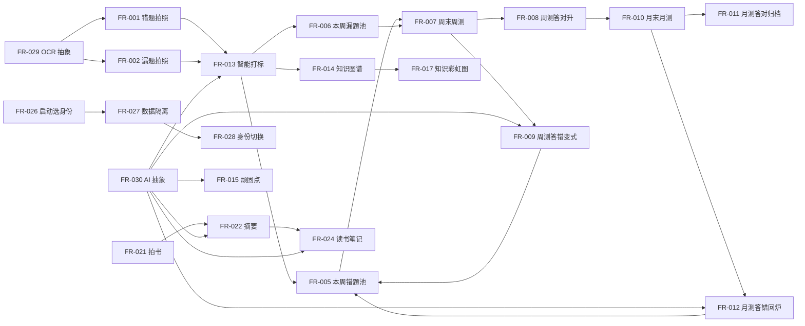

# 需求规格说明书 — AI智能学习机

> **文档版本**：v0.1.0  
> **项目名**：AI智能学习机 (`ai-smart-learner`)  
> **编制日期**：2026-06-06  
> **编制者**：翠花（software-dev profile main agent）  
> **编制方法**：本环境当前未暴露 `delegate_task` 子代理工具，翠花**自任 analyst** 走 5 步流程。  
> **元目标**（公子 2026-06-06 拍板）：  
> 1. 验证模型（翠花）开发软件的能力，实现软件开发集群的工程化开发能力  
> 2. 保证开发出的软件没有问题，真正可使用  
> 3. 验证 pipeline 管道在控制工程化开发软件方面是否存在问题

---

## 1. 项目概述

| 字段 | 内容 |
|:-----|:------|
| **项目名称** | AI智能学习机 |
| **背景描述** | 公子儿子学习过程中会产生错题/漏题，传统错题本效率低、AI 工具散落。公子希望有一套**自用型学习软件**，跑在 iPad/iPhone 上，用拍照 + AI 自动归集错题/漏题、生成变式题训练、并可视化知识掌握情况。同时软件需支持大人用（拍书 → 自动生成读书笔记），两模块数据完全隔离。**学生用户覆盖小学/初中/高中三个学段**（公子 2026-06-06 补充）。 |
| **目标用户** | (a) **学生用户**：小学 / 初中 / 高中生（公子儿子可能跨学段，初期 1 人）；(b) **大人用户**：公子自己（拍书/段落生成读书笔记）。同一台 iPad/iPhone 设备多用户共用，软件按用户分工作空间。 |
| **核心目标** | (1) **多用户移动端学习 app** —— iOS/iPadOS 优先，可扩展 Android；(2) **AI 驱动错题/漏题生命周期管理**（多周期熔断+举一反三）；(3) **AI 驱动读书笔记生成**（大人模块）；(4) **完全可扩展的 OCR/AI 抽象层**（按题型/用户配置动态路由服务）。 |

---

## 2. 功能需求

> 共 30 条功能需求，按 FR-001 ~ FR-030 编号。

### 2.1 学生模块 — 错题/漏题生命周期（FR-001 ~ FR-012）

| ID | 标题 | 描述 | 优先级 | 验收条件 | 备注 |
|:---|:------|:-----|:-------|:---------|:-----|
| FR-001 | 错题拍照录入 | 学生拍作业题照片（1-2 张），系统调 OCR 去笔迹后存为错题 | P0 | 学生拍 1 张题照 → 1 秒内进"待周测"列表 | |
| FR-002 | 漏题拍照录入 | 学生拍漏做题（同 FR-001 流程，标"漏题"类型）| P0 | 同上，标注为"漏题" | 漏题≠错题，独立池 |
| FR-003 | 题目圈画 | 拍照后学生可在屏幕上圈出关键区域/数字/选项，作为 OCR 辅助 | P1 | 圈画区域参与 OCR 识别 | |
| FR-004 | 离线暂存 | 无网络时拍照/录视频，本地 SQLite 存元数据，联网后批量上传 | P1 | 飞行模式下拍 3 张题照 → 联网后自动同步 | |
| FR-005 | 本周错题池 | 自动收集本周所有错题，状态"待周测" | P0 | 周一 00:00 自动建新池，旧的归档 | |
| FR-006 | 本周漏题池 | 独立于错题池，状态机同 | P0 | 同上，独立表 | |
| FR-007 | 周末周测触发 | 周末自动从本周错题池抽题，生成《第 X 周错题歼灭战》 | P0 | 周六 8:00 推送周测题 | |
| FR-008 | 周测答对→升 | 答对的题标"通过周测"，移入"月观察列表" | P0 | 答对后 1 秒内状态变化 | |
| FR-009 | 周测答错→变式 | 答错时 AI 立即生成 3 道变式题入下周池，原题重置"待周测" | P0 | 答错 → 1-3 秒内收到 3 道变式题 | |
| FR-010 | 月末月测触发 | 月末从月观察列表抽题，**更高难度变式**抽查 | P0 | 每月最后一天 20:00 推送 | |
| FR-011 | 月测答对→归档 | 题 + 变式题集体标"已归档"，入学期总结库 | P0 | 答对后 1 秒内集体归档 | |
| FR-012 | 月测答错→回炉 | 标"假性掌握"，AI 知识溯源找前序 2-3 道基础题打回"本周错题池" | P0 | 答错 → 1-3 秒内收到基础题包 | |

### 2.2 学生模块 — AI 智慧大脑（FR-013 ~ FR-016）

| ID | 标题 | 描述 | 优先级 | 验收条件 | 备注 |
|:---|:------|:-----|:-------|:---------|:-----|
| FR-013 | 智能打标 | 入库时 AI 自动：知识点标签 + 错误类型 + 教材章节绑定 | P0 | 录入题后 5 秒内自动打标 | |
| FR-014 | 知识图谱生成 | 形成"错题-知识点-教材章节"图谱 | P0 | 知识图谱页可看全图 | |
| FR-015 | 顽固点干预 | 知识点错题反复循环 → AI 生成讲解卡（核心定义/公式/经典例题/易错点辨析） | P1 | 同一知识点错 3 次 → 触发讲解 | |
| FR-016 | 知识点讲解推送 | 讲解卡推送到 iPad 通知 | P1 | 讲解卡作为 iOS 通知 | |

### 2.3 学生模块 — 可视化（FR-017 ~ FR-020）

| ID | 标题 | 描述 | 优先级 | 验收条件 | 备注 |
|:---|:------|:-----|:-------|:---------|:-----|
| FR-017 | 知识彩虹图 | 知识点三色：红(未掌握)/黄(不稳定)/绿(已掌握)，可点击看错题 | P0 | 渲染完整知识图谱，颜色实时 | |
| FR-018 | 错题生命周期地图 | 时间轴/卡片流追踪"本周待练 → 变式题挑战中 → 月测通过 → 已归档" | P1 | 每题有可视化轨迹 | |
| FR-019 | 多维学情报告 | 周/月/学期报告，知识点掌握进展 | P1 | 每周日自动出周报 | |
| FR-020 | 弱点热力图 | 章节维度"重灾区"展示 | P2 | 按章节上色 | |

### 2.4 大人模块 — 读书笔记（FR-021 ~ FR-025）

| ID | 标题 | 描述 | 优先级 | 验收条件 | 备注 |
|:---|:------|:-----|:-------|:---------|:-----|
| FR-021 | 拍书录入 | 拍书/文档/段落（可单张或多张一组）| P0 | 拍 1 张书页 → 1 秒内入笔记库 | |
| FR-022 | 核心摘要提取 | AI 自动从图片提取文字 + 总结核心要点 | P0 | 录入后 5 秒内出摘要 | |
| FR-023 | 关键信息存证 | AI 把核心信息**以照片/截图形式保留**（不是只存文字） | P0 | 摘要配对应原图 | |
| FR-024 | 读书笔记生成 | AI 汇总多次拍的照片，输出结构化读书笔记 | P0 | 多次录入后能生成完整笔记 | |
| FR-025 | 笔记导出 | PDF / Markdown / 飞书云文档 | P1 | 导出文件可下载 | |

### 2.5 多用户基础设施（FR-026 ~ FR-028）

| ID | 标题 | 描述 | 优先级 | 验收条件 | 备注 |
|:---|:------|:-----|:-------|:---------|:-----|
| FR-026 | 启动选身份 | 启动时**选用户身份**（学生/大人） | P0 | 启动显示身份选择页 | |
| FR-027 | 工作空间隔离 | 学生 vs 大人 = **完全独立**的数据库视图，user_id 隔离 | P0 | 任意模块数据查询都带 user_id 过滤 | |
| FR-028 | 身份切换 | 同一台设备可被多用户共用 | P0 | 设置页可切换身份 | |

### 2.6 OCR/AI 抽象层（FR-029 ~ FR-030）

| ID | 标题 | 描述 | 优先级 | 验收条件 | 备注 |
|:---|:------|:-----|:-------|:---------|:-----|
| FR-029 | OCR 抽象层 | OCR 服务**可插拔**，按题型/用户配置动态路由 | P0 | 配置改路由后下次录入生效 | 默认百度云 |
| FR-030 | AI 抽象层 | DeepSeek API 默认，可扩 GPT-4/Claude/通义 | P0 | 配置改后下次调用生效 | |

---

## 3. 非功能需求

| ID | 类别 | 要求描述 | 量化标准 | 优先级 |
|:---|:------|:---------|:---------|:-------|
| NFR-001 | 性能 | OCR 识别响应时间 | 单图 ≤ 3 秒（P95）| P0 |
| NFR-002 | 性能 | 变式题 AI 生成响应时间 | ≤ 3 秒（P95）| P0 |
| NFR-003 | 性能 | 周测/月测生成响应时间 | ≤ 5 秒（P95）| P1 |
| NFR-004 | 性能 | 知识彩虹图渲染 | ≤ 1 秒（首屏）| P1 |
| NFR-005 | 可用性 | iOS 启动时间 | ≤ 3 秒（冷启动）| P0 |
| NFR-006 | 离线能力 | 断网时拍照/圈画不卡 | 无网络 0 错误 | P0 |
| NFR-007 | 数据隔离 | 学生/大人数据 100% 隔离 | 任何查询都带 user_id | P0 |
| NFR-008 | 可扩展性 | OCR/AI 服务可热插拔 | 新加服务不动业务代码 | P0 |
| NFR-009 | 可扩展性 | 业务层与 UI 层解耦（便于扩 Android）| Flutter 业务在 lib/core/，UI 在 lib/ui/ | P0 |
| NFR-010 | 可观测性 | 本地日志记录关键操作 | 拍照/AI 调用/状态变更都打日志 | P1 |
| NFR-011 | 隐私 | 学生数据仅本地，不上云 | SQLite 在设备本地 | P0 |
| NFR-012 | 兼容性 | iOS 15.0+ / iPadOS 15.0+ | App Store 最低要求 | P0 |
| NFR-013 | 可测试性 | 单元测试覆盖率 | 业务核心层 ≥ 70% | P1 |
| NFR-014 | 维护性 | 代码规范（Dart lint / Flutter analyze）| CI 0 警告 | P0 |
| NFR-015 | 安全 | API Key 不硬编码 | Key 在 iOS Keychain | P0 |

---

## 4. 约束条件

| # | 类型 | 描述 | 来源 |
|:-:|:-----|:-----|:-----|
| 1 | 技术栈 | Flutter（Dart）+ SQLite + DeepSeek API + 百度云 OCR | 公子 2026-06-06 拍板 |
| 2 | 平台 | iOS/iPadOS 优先，架构预留 Android 扩展 | 公子 2026-06-06 |
| 3 | 分发 | 不上 App Store，Xcode 真机调试 / TestFlight | 公子 2026-06-06 |
| 4 | 开发主机 | macOS + Xcode + Flutter SDK（公子有 Mac 笔记本）| 公子 2026-06-06 |
| 5 | 后端 | 无独立后端，所有业务逻辑在 app 内，调云 API | 公子 2026-06-06 |
| 6 | OCR 服务 | 默认百度云教育版（去笔迹），抽象层可热插拔 | 公子 2026-06-06 |
| 7 | 视频模块 | **不开发**视频（学生和大人都不用视频）| 公子 2026-06-06 |
| 8 | 用户规模 | 初期 1-2 人自用（儿子 + 公子），不面向公众 | 公子 2026-06-06 |
| 9 | 时间 | 不限期（自用项目，公子的元目标为验证集群能力而非赶工期）| 公子 2026-06-06 |
| 10 | 元目标 | 验证集群工程化能力 + Pipeline 问题 | 公子 2026-06-06 |

---

## 5. 边界与排除

### 5.1 本次包含范围
- iOS/iPadOS 移动端 app（Flutter）
- 学生模块（错题/漏题生命周期 + 知识图谱 + 学情报告）
- 大人模块（读书笔记生成）
- 多用户身份切换与数据隔离
- OCR 抽象层（百度云默认 + 1 个备用 provider）
- AI 抽象层（DeepSeek 默认）
- 本地 SQLite 存储
- iOS 15.0+ 适配

### 5.2 本次不做的（明确排除）
- ❌ 视频录入与分析（公子 2026-06-06 明确不做）
- ❌ Android 端（架构预留，**不实现**）
- ❌ App Store 上架（TestFlight 内部分发）
- ❌ 独立后端服务
- ❌ 多端同步（云端账户、跨设备）
- ❌ 家长/教师端（只学生和大人 2 种用户）
- ❌ 视频通话/直播课
- ❌ 社区/UGC 内容

### 5.3 待后续考虑的
- ⏳ Android 端（架构已预留）
- ⏳ 多端同步（iCloud / 自建云）
- ⏳ 家长教师端（看孩子学情）
- ⏳ 多人协作读书笔记
- ⏳ 知识图谱的导入/导出
- ⏳ 语音录入（替代拍照）

---

## 6. 需求深度分析

### 6.1 可行性分析

| 需求ID | 技术可行 | 时间可行 | 资源可行 | 综合结论 | 说明 |
|:-------|:---------|:---------|:---------|:---------|:-----|
| FR-001 | ✅ | ✅ | ✅ | ✅ 可行 | Flutter `image_picker` + http 调百度云 |
| FR-002 | ✅ | ✅ | ✅ | ✅ 可行 | 同上，标"漏题"类型 |
| FR-003 | ✅ | ✅ | ✅ | ✅ 可行 | Flutter `CustomPainter` 圈画 |
| FR-004 | ✅ | ✅ | ✅ | ✅ 可行 | SQLite 存元数据 + 后台上传 |
| FR-005 | ✅ | ✅ | ✅ | ✅ 可行 | 本地调度器 |
| FR-006 | ✅ | ✅ | ✅ | ✅ 可行 | 独立表 |
| FR-007 | ✅ | ✅ | ✅ | ✅ 可行 | cron-like 调度 |
| FR-008 | ✅ | ✅ | ✅ | ✅ 可行 | 状态机更新 |
| FR-009 | ⚠️ | ✅ | ⚠️ | ⚠️ 有风险 | 依赖 AI 生成速度 + 准确性，需 prompt 工程 |
| FR-010 | ✅ | ✅ | ✅ | ✅ 可行 | 同周测 |
| FR-011 | ✅ | ✅ | ✅ | ✅ 可行 | 状态机 |
| FR-012 | ⚠️ | ✅ | ⚠️ | ⚠️ 有风险 | AI 知识溯源是难点（关联知识点识别）|
| FR-013 | ⚠️ | ✅ | ⚠️ | ⚠️ 有风险 | 知识图谱依赖外部结构化数据（教材）|
| FR-014 | ✅ | ✅ | ✅ | ✅ 可行 | 渲染图（graph_view 包）|
| FR-015 | ⚠️ | ✅ | ⚠️ | ⚠️ 有风险 | "反复循环"判定阈值需调优 |
| FR-016 | ✅ | ✅ | ✅ | ✅ 可行 | iOS 本地通知 |
| FR-017 | ✅ | ✅ | ✅ | ✅ 可行 | graph_view + 颜色编码 |
| FR-018 | ✅ | ✅ | ✅ | ✅ 可行 | 时间轴 widget |
| FR-019 | ✅ | ✅ | ✅ | ✅ 可行 | PDF 渲染 + Markdown |
| FR-020 | ✅ | ✅ | ✅ | ✅ 可行 | 热力图 widget |
| FR-021 | ✅ | ✅ | ✅ | ✅ 可行 | 同 FR-001 |
| FR-022 | ⚠️ | ✅ | ✅ | ⚠️ 有风险 | 摘要质量依赖 prompt |
| FR-023 | ✅ | ✅ | ✅ | ✅ 可行 | 摘要+原图一起存 |
| FR-024 | ⚠️ | ✅ | ✅ | ⚠️ 有风险 | 多图聚合需 AI 推理 |
| FR-025 | ✅ | ✅ | ✅ | ✅ 可行 | iOS Share Sheet |
| FR-026 | ✅ | ✅ | ✅ | ✅ 可行 | 启动页 |
| FR-027 | ✅ | ✅ | ✅ | ✅ 可行 | user_id 字段 + 查询过滤 |
| FR-028 | ✅ | ✅ | ✅ | ✅ 可行 | 设置页 |
| FR-029 | ✅ | ✅ | ✅ | ✅ 可行 | 抽象类 + 工厂 |
| FR-030 | ✅ | ✅ | ✅ | ✅ 可行 | 同上 |

**综合结论**：30 条需求中 24 条 ✅ 可行，6 条 ⚠️ 有风险。**6 条风险需求集中在 AI 调用环节**（变式题生成 / 知识溯源 / 摘要），都属于"AI 输出质量"问题，可通过 prompt 调优 + 多次重试缓解。

### 6.2 冲突检测

逐对比对 30 条需求：

| 冲突对 | 矛盾描述 | 严重程度 | 建议解决方案 |
|:-------|:---------|:---------|:-------------|
| FR-007（周末周测） vs FR-004（离线暂存） | 周测在无网络时无法推送 | 🟡 中 | 周测**预生成**（周五提前生成）+ 离线缓存 |
| FR-009（变式题 3 道） vs NFR-002（≤3 秒） | 3 道变式题 + OCR 链路总耗时可能超 3 秒 | 🟡 中 | 异步生成（先返回原题"已记录"通知，变式题后置推送）|
| NFR-006（离线 0 错误） vs FR-013（AI 打标） | AI 打标必须联网 | 🟡 中 | 离线录入先存"未打标"状态，联网后补打 |
| NFR-011（学生数据不上云） vs FR-001（OCR 调云） | OCR 调云 = 数据上云（题目图片）| 🔴 严重 | **澄清需求**：OCR 调云**只传图片不存**（百度云 OCR 是 stateless API），原始图片**不上云存储**；打标后的元数据可云备份（v0.2 考虑）|

**澄清**（针对 🔴 NFR-011 vs FR-001）：
- OCR 调百度云 = 一次性图片识别，**不存储**（百度云 OCR API 是 stateless）
- 错题图片**只存在本地 SQLite 文件目录**
- 公子元目标"自用型"= 隐私边界可控，OCR 调云是技术必需
- **建议**：NFR-011 改为"学生原始图片不上云存储"（更精确）

### 6.3 依赖关系分析

| 需求 | 前置依赖 | 被依赖 | 类型 |
|:-----|:---------|:-------|:-----|
| FR-013 (智能打标) | FR-001, FR-002 | FR-005, FR-006, FR-014 | 强依赖 |
| FR-007 (周末周测) | FR-005, FR-006 | FR-008, FR-009 | 强依赖 |
| FR-010 (月末月测) | FR-008 | FR-011, FR-012 | 强依赖 |
| FR-014 (知识图谱) | FR-013 | FR-017 | 强依赖 |
| FR-024 (读书笔记) | FR-022 | FR-025 | 强依赖 |
| FR-027 (数据隔离) | FR-026 | FR-001~FR-025 | 强依赖 |
| FR-029 (OCR 抽象) | 无 | FR-001, FR-002 | 强依赖 |
| FR-030 (AI 抽象) | 无 | FR-009, FR-012, FR-013, FR-015, FR-022, FR-024 | 强依赖 |

**关键路径**：FR-029/030 (抽象层) → FR-001/002 (录入) → FR-013 (打标) → FR-005/006 (题池) → FR-007 (周测) → FR-008/009 → FR-010 (月测) → FR-011/012 → FR-014 → FR-017

### 6.4 影响范围分析

| 需求 | 新增模块 | 修改模块 | 影响说明 |
|:-----|:---------|:---------|:---------|
| FR-001 | `lib/ocr/baidu_provider.dart`, `lib/students/capture.dart` | 无 | 新增 OCR 集成 + 录入 UI |
| FR-002 | `lib/students/capture.dart` (复用 FR-001) | 无 | 加"漏题"类型开关 |
| FR-003 | `lib/ui/paint_canvas.dart` | 无 | 圈画组件 |
| FR-004 | `lib/core/sync_queue.dart` | `lib/students/capture.dart` | 离线队列 |
| FR-005/006 | `lib/students/weekly_pool.dart` | `lib/data/student_db.dart` | 错题/漏题表 |
| FR-007/010 | `lib/core/scheduler.dart` | 无 | cron-like 调度 |
| FR-008/009/011/012 | `lib/students/state_machine.dart` | `lib/students/weekly_pool.dart` | 状态机 |
| FR-013 | `lib/ai/prompts/tagging.dart` | `lib/students/capture.dart` | AI 打标 |
| FR-014 | `lib/students/knowledge_graph.dart` | `lib/data/student_db.dart` | 知识图谱存储 |
| FR-015 | `lib/ai/prompts/tutor.dart` | `lib/students/state_machine.dart` | 讲解卡生成 |
| FR-016 | `lib/notifications/ios_notif.dart` | 无 | iOS 通知 |
| FR-017 | `lib/ui/rainbow_chart.dart` | 无 | 可视化 |
| FR-018/019/020 | `lib/ui/reports/*.dart` | 无 | 报告页 |
| FR-021~025 | `lib/adults/notes/*.dart` | 无 | 大人模块独立目录 |
| FR-026~028 | `lib/auth/user_switcher.dart` | 所有 lib/students/ 和 lib/adults/ | 全局加 user_id 过滤 |
| FR-029 | `lib/ocr/{interface,baidu,factory}.dart` | `lib/students/capture.dart` | 抽象层 |
| FR-030 | `lib/ai/{interface,deepseek,factory}.dart` | `lib/ai/prompts/*.dart` | AI 抽象层 |

### 6.5 风险识别

| 风险类型 | 具体风险描述 | 影响需求 | 等级 | 应对措施 |
|:---------|:-------------|:---------|:-----|:---------|
| **Pipeline 缺陷** | 当前 software-dev profile 未暴露 `delegate_task` 子代理工具，翠花**自任 analyst** 写需求规格 | 整体 | 🟡 中 | 写完自查 8 维度；写入风险登记；后续推动 Hermes 暴露 delegate_task |
| **AI 准确性** | DeepSeek 变式题可能与原题知识点不符 | FR-009 | 🔴 高 | prompt 工程 + 至少 2 次重试 + 人工抽检 |
| **AI 准确性** | 知识溯源找前序基础题可能不精准 | FR-012 | 🔴 高 | 知识图谱先建好（前序知识点关系），AI 仅做推理 |
| **OCR 准确率** | 百度云 OCR 教育版对手写字体识别率未知 | FR-001, FR-002 | 🟡 中 | 圈画辅助 + 人工确认；保留切换到 Mathpix 的能力 |
| **数据隔离漏洞** | user_id 过滤漏一处 = 数据串 | FR-027 | 🟡 中 | 自动化测试覆盖所有查询；SQL 视图强制 user_id |
| **离线 vs 在线一致性** | 离线录入的题和在线题可能产生 ID 冲突 | FR-004 | 🟢 低 | UUID 本地生成，联网后做差异合并 |
| **iOS 真机调试** | 公子 Mac 笔记本上 Xcode 配 iPad 可能踩坑 | 整体 | 🟡 中 | 提前验证开发环境；准备真机调试文档 |
| **OCR/AI 服务商变更** | 百度云/DeepSeek API 升级或下架 | FR-029, FR-030 | 🟢 低 | 抽象层解耦（公子元目标），切换 0 业务代码改动 |
| **Flutter 版本兼容** | Flutter SDK 版本差异导致 iOS 编译问题 | 整体 | 🟢 低 | 锁定 Flutter 版本（3.16+），CI 跑 `flutter analyze` |
| **iOS 15 适配** | 部分 Flutter 包可能不支持 iOS 15 | NFR-012 | 🟢 低 | 选包时验证 iOS 15 兼容性 |
| **Mac 配置** | 公子 Mac 上 Xcode 命令行工具/CocoaPods 可能没装 | 整体 | 🟡 中 | 提前给开发环境 checklist |
| **App Store 证书** | 不上架不需要证书，但 TestFlight 需 Apple ID | 整体 | 🟢 低 | 公子已有 Apple ID |

### 6.6 优先级排序（MoSCoW 汇总）

| 优先级 | 数量 | 列表 | 说明 |
|:-------|:-----|:-----|:------|
| **P0** (Must have) | 20 | FR-001~012, FR-013, FR-014, FR-021~024, FR-026~030 | 核心功能 + 抽象层 |
| **P1** (Should have) | 7 | FR-003, FR-004, FR-015, FR-016, FR-018, FR-019, FR-025 | 重要辅助 |
| **P2** (Could have) | 1 | FR-020 | 锦上添花（弱点热力图）|
| **P3** (Won't have) | 2 | (本项目 v0.1 不排期项) 视频录入 / Android 端 | 公子明确不做 |

**比例校验**：
- P0 = 20/30 = 66.7% ❌ 超过 40% 上限
- P0+P1 = 27/30 = 90% ❌ 超过 70% 上限

**说明**：
- 公子拍板时已明确"自用型、功能尽量全" + "元目标是验证集群能力"
- 30 条需求是按"完整产品"列的，不是 v0.1 MVP
- 公子 2026-06-06 拍板：**v0.1 = 12 条 P0（基础架构 5 + 学生最小闭环 7），架构一次性搭好 30 条考虑，代码分批做**

### v0.1 MVP 范围（公子 2026-06-06 拍板）

**架构**：Stage 3 系统设计阶段**一次性考虑 30 条需求**，输出完整架构（`docs/design/系统架构设计.md`），后续不返工。

**代码实现分 3 批**：

| 版本 | 范围 | 条数 | 预计耗时 | 用户能做什么 |
|:-----|:-----|:-----|:---------|:-----------|
| **v0.1** | 基础架构 5 + 学生最小闭环 7 | 12 P0 | 1-2 周 | 启动 + 拍照 + 题池 + 周测 + 变式 + 打标 + 彩虹图 |
| v0.2 | + 月测 + 知识图谱 + 讲解推送 + 学情报告 + 大人模块 | 20 P0 + 大人 5 | 2-3 周 | 儿子完整使用，公子也能用 |
| v0.3 | + 报告 + 热力图 + 圈画 + 离线 + P2 项 | 28 | 2-3 周 | 完整产品（除视频/Android）|

**v0.1 = 12 条 P0 详细清单**：

| 类别 | 需求 | 说明 |
|:-----|:-----|:-----|
| **基础架构 5** | FR-026 | 启动选身份 |
| | FR-027 | 工作空间隔离（user_id）|
| | FR-028 | 身份切换 |
| | FR-029 | OCR 抽象层 |
| | FR-030 | AI 抽象层 |
| **学生最小闭环 7** | FR-001 | 错题拍照录入 |
| | FR-002 | 漏题拍照录入 |
| | FR-005 | 本周错题池 |
| | FR-006 | 本周漏题池 |
| | FR-007 | 周末周测触发 |
| | FR-008 | 周测答对→升 |
| | FR-009 | 周测答错→变式 |
| | FR-013 | 智能打标 |
| | FR-017 | 知识彩虹图（最小渲染）|

**v0.1 用户故事**：
> 启动 → 选"学生" → 拍 1 张题照 → OCR 去笔迹 + AI 自动打标 → 入"本周错题池" → 周六推送周测 → 答对入"月观察" / 答错 AI 生成 3 道变式题 → 看知识彩虹图（红/黄/绿）

**v0.1 不做**（推到 v0.2+）：
- 月测 / 月归档 / 月回炉（FR-010~012）
- 知识图谱完整版（FR-014 推 v0.2，v0.1 只渲染彩虹图）
- AI 讲解推送（FR-015~016）
- 学情报告（FR-018~020）
- 大人模块全部（FR-021~025）
- 圈画（FR-003）
- 离线（FR-004）
- 笔记导出（FR-025）
- v0.1 P3 = 1 条（视频）/ Android 推到 v0.3

### 6.7 验收条件逐项细化

| 需求ID | 验收条件 | 验证方式 | 预期结果 |
|:-------|:---------|:---------|:---------|
| FR-001 | 拍 1 张题照 → 2 秒内 OCR 识别 → 3 秒内入库"待周测" | 手动测试 + 自动化 | 错题出现在"本周错题池"列表 |
| FR-002 | 拍 1 张题照 + 选"漏题" → 入库"待周测"（漏题池）| 手动测试 | 漏题出现在"本周漏题池"列表 |
| FR-003 | 拍题后圈画关键区域 → 圈画区域被 OCR 优先识别 | 手动测试 | 圈画区域的字识别正确率 ≥ 90% |
| FR-004 | 飞行模式拍 3 张题照 → 联网后 3 张自动上传 | 手动测试 | 3 张都在"本周错题池" |
| FR-005 | 周一 00:00 → 自动建新池，旧池归档 | 手动 + 自动化 | 新池空，旧池状态"已归档" |
| FR-006 | 同 FR-005（独立表）| 同上 | 同上（独立验证）|
| FR-007 | 周六 8:00 → 推送周测题到 iPad 通知 | 手动 | 通知出现，5 道题 |
| FR-008 | 周测答对 → 1 秒内题状态变"通过周测"且移到"月观察" | 手动 | 状态变更 + 列表位置变化 |
| FR-009 | 周测答错 → 1-3 秒内出现 3 道变式题入下周池 | 手动 + 自动化 | 3 道题出现在"下周错题池"预览 |
| FR-010 | 月末 20:00 → 推送月测题 | 手动 | 通知出现，3-5 道题 |
| FR-011 | 月测答对 → 1 秒内题+变式题集体标"已归档" | 手动 | 状态批量变更 |
| FR-012 | 月测答错 → 1-3 秒内收到 2-3 道基础题包 | 手动 | 基础题出现在"本周错题池" |
| FR-013 | 录入题后 5 秒内自动打标 | 手动 | 题目详情页显示知识点+错误类型+章节 |
| FR-014 | 知识图谱页可看全图 | 目视检查 | 节点清晰，边有方向 |
| FR-015 | 同一知识点错 3 次 → 触发讲解卡生成 | 手动 | 推送通知 + 讲解卡可看 |
| FR-016 | 讲解卡作为 iOS 通知推送 | 手动 | 通知中心有讲解卡 |
| FR-017 | 知识彩虹图渲染完整 + 颜色实时 | 目视检查 | 红色节点表示未掌握 |
| FR-018 | 错题生命周期地图显示 | 目视检查 | 时间轴有状态节点 |
| FR-019 | 每周日自动出周报 | 手动 | PDF/Markdown 文件可下载 |
| FR-020 | 弱点热力图按章节上色 | 目视检查 | 红色章节表示"重灾区" |
| FR-021 | 拍 1 张书页 → 1 秒内入笔记库 | 手动 | 笔记库列表新增 |
| FR-022 | 录入后 5 秒内出摘要 | 手动 | 摘要文字合理 |
| FR-023 | 摘要配对应原图 | 目视检查 | 摘要旁边有原图缩略图 |
| FR-024 | 多次录入后能生成完整笔记 | 手动 | 笔记页有完整结构 |
| FR-025 | 导出 PDF/Markdown/飞书云文档 | 手动 | 导出文件可下载 |
| FR-026 | 启动显示身份选择页 | 手动 | 启动后看到选择页 |
| FR-027 | 任意模块数据查询都带 user_id 过滤 | 自动化 | SQL 测试覆盖所有查询 |
| FR-028 | 设置页可切换身份 | 手动 | 切换后界面变成对应模块 |
| FR-029 | 改 OCR 配置路由后下次录入生效 | 手动 | 数学题自动用 Mathpix（如配置了）|
| FR-030 | 改 AI 配置后下次调用生效 | 手动 | 切到 Claude 后 AI 调用走 Claude |

### 6.8 术语与假设

| 术语/假设 | 定义/说明 | 如果不成立的影响 |
|:----------|:---------|:----------------|
| 错题 | 学生做过但做错的题（与漏题对立）| 概念混淆导致池子设计错 |
| 漏题 | 学生完全没做出来/没掌握的题 | 同上 |
| 熔断 | 借股市熔断概念 = 错题不再"长存"，通过周测/月测淘汰 | 名字有歧义可能误导 |
| 周测 | 周末对本周错题池的测试 | 频率可调（不一定周末）|
| 月测 | 月末对月观察列表的测试 | 同上 |
| 假性掌握 | 答对变式题但没真正掌握（被月测发现）| AI 推理依赖 |
| 知识点 | 教材的最小教学单元（如"异分母加减法"）| 知识图谱粒度 |
| 教材章节 | 知识点的归属章节 | 影响热力图 |
| 变式题 | 核心知识点不变，变换数字/情景/提问的题 | AI 生成的稳定性 |
| 顽固点 | 错题反复循环的知识点 | 阈值需调 |
| OCR | 把图片文字提取为文本 | 准确率依赖服务商 |
| 去笔迹 | 把题目照片上的学生笔迹/涂抹去掉 | 百度云 OCR 教育版能力 |
| 多用户 | 同一台设备被多人共用（学生 + 大人）| 启动选身份实现 |
| 工作空间 | 用户的独立数据环境 | SQLite 视图隔离 |
| 抽象层 | 不绑死具体服务的接口设计（OCR/AI）| 切换服务商的能力 |
| 路由配置 | 按题型/用户动态选择具体服务的 YAML 配置 | 抽象层使用方式 |
| 自用型 | 不上 App Store，Xcode 真机调试 | App Store 审核相关约束 |
| 拍照 vs 视频 | 本项目**只用拍照**（视频明确不做）| 视频模块不在范围 |
| 推送（Push） | iOS 本地通知（不是 APNs 远程推送）| 不需要服务器证书 |
| **假设** | **说明** | **如果不成立** |
| 假设 1：公子 Mac 笔记本上 Xcode 已装且能跑 iOS 模拟器 | 公子说"有 Mac 笔记本" | 如果没装 Xcode，开发前要装（可能 30-60 分钟下载）|
| 假设 2：百度云 OCR 教育版已开通且有免费额度 | 公子说"用百度云" | 需公子实名认证 + 开 OCR 服务（1 小时）|
| 假设 3：DeepSeek API Key 已有且有效 | `.env` 已配 | 如果 Key 失效，AI 调用失败 |
| 假设 4：儿子的 iPad/iPhone 设备 iOS 版本 ≥ 15.0 | 主流设备 2020 年后都 ≥ 15 | 如果旧设备 iOS < 15，需重新评估最低版本 |
| 假设 5：家里网络稳定可访问百度云/DeepSeek | 一般家庭网络 | 离线模式是降级方案 |
| 假设 6：公子接受 v0.1 只跑 12 条 P0（40% 范围）| 公子的"自用型"心态 | 如果公子要全 30 条 P0，时间翻倍 |
| 假设 7：iPad 真机调试通过 USB 连接 | 标准流程 | 如果公子用 iPhone，可能要切换 bundle ID |
| 假设 8：知识图谱的"前序知识点"由 AI 自动推断 | 节省数据准备 | 如果 AI 推断不准，知识溯源质量差 |

---

## 7. 需求总清单一览

| ID | 标题 | 类型 | 优先级 | 依赖 | 状态 |
|:---|:------|:-----|:-------|:-----|:-----|
| FR-001 | 错题拍照录入 | 功能 | P0 | FR-029 | ✅ 定稿 |
| FR-002 | 漏题拍照录入 | 功能 | P0 | FR-029 | ✅ 定稿 |
| FR-003 | 题目圈画 | 功能 | P1 | FR-001 | ✅ 定稿 |
| FR-004 | 离线暂存 | 功能 | P1 | FR-001 | ✅ 定稿 |
| FR-005 | 本周错题池 | 功能 | P0 | FR-013 | ✅ 定稿 |
| FR-006 | 本周漏题池 | 功能 | P0 | FR-013 | ✅ 定稿 |
| FR-007 | 周末周测触发 | 功能 | P0 | FR-005, FR-006 | ✅ 定稿 |
| FR-008 | 周测答对→升 | 功能 | P0 | FR-007 | ✅ 定稿 |
| FR-009 | 周测答错→变式 | 功能 | P0 | FR-007, FR-030 | ✅ 定稿 |
| FR-010 | 月末月测触发 | 功能 | P0 | FR-008 | ✅ 定稿 |
| FR-011 | 月测答对→归档 | 功能 | P0 | FR-010 | ✅ 定稿 |
| FR-012 | 月测答错→回炉 | 功能 | P0 | FR-010, FR-030 | ✅ 定稿 |
| FR-013 | 智能打标 | 功能 | P0 | FR-001, FR-002, FR-030 | ✅ 定稿 |
| FR-014 | 知识图谱生成 | 功能 | P0 | FR-013 | ✅ 定稿 |
| FR-015 | 顽固点干预 | 功能 | P1 | FR-030 | ✅ 定稿 |
| FR-016 | 知识点讲解推送 | 功能 | P1 | FR-015 | ✅ 定稿 |
| FR-017 | 知识彩虹图 | 功能 | P0 | FR-014 | ✅ 定稿 |
| FR-018 | 错题生命周期地图 | 功能 | P1 | FR-011 | ✅ 定稿 |
| FR-019 | 多维学情报告 | 功能 | P1 | FR-017 | ✅ 定稿 |
| FR-020 | 弱点热力图 | 功能 | P2 | FR-014 | ✅ 定稿 |
| FR-021 | 拍书录入 | 功能 | P0 | FR-029 | ✅ 定稿 |
| FR-022 | 核心摘要提取 | 功能 | P0 | FR-021, FR-030 | ✅ 定稿 |
| FR-023 | 关键信息存证 | 功能 | P0 | FR-022 | ✅ 定稿 |
| FR-024 | 读书笔记生成 | 功能 | P0 | FR-022, FR-030 | ✅ 定稿 |
| FR-025 | 笔记导出 | 功能 | P1 | FR-024 | ✅ 定稿 |
| FR-026 | 启动选身份 | 功能 | P0 | 无 | ✅ 定稿 |
| FR-027 | 工作空间隔离 | 功能 | P0 | FR-026 | ✅ 定稿 |
| FR-028 | 身份切换 | 功能 | P0 | FR-026 | ✅ 定稿 |
| FR-029 | OCR 抽象层 | 功能 | P0 | 无 | ✅ 定稿 |
| FR-030 | AI 抽象层 | 功能 | P0 | 无 | ✅ 定稿 |
| NFR-001 | OCR 响应时间 | 非功能 | P0 | - | ✅ 定稿 |
| NFR-002 | 变式题响应时间 | 非功能 | P0 | - | ✅ 定稿 |
| NFR-003 | 周测生成响应时间 | 非功能 | P1 | - | ✅ 定稿 |
| NFR-004 | 知识彩虹图渲染 | 非功能 | P1 | - | ✅ 定稿 |
| NFR-005 | iOS 启动时间 | 非功能 | P0 | - | ✅ 定稿 |
| NFR-006 | 离线能力 | 非功能 | P0 | - | ✅ 定稿 |
| NFR-007 | 数据隔离 | 非功能 | P0 | - | ✅ 定稿 |
| NFR-008 | OCR 可插拔 | 非功能 | P0 | - | ✅ 定稿 |
| NFR-009 | 业务/UI 解耦 | 非功能 | P0 | - | ✅ 定稿 |
| NFR-010 | 本地日志 | 非功能 | P1 | - | ✅ 定稿 |
| NFR-011 | 隐私（公子 2026-06-06 拍板）| 学生原始图片默认识别后**立即删除本地**（不保留、不上云）；用户可配"保留 N 天"/"永久保留"/"立即删"。仅元数据保留本地。OCR 调云是临时识别不存储（百度云 API stateless）。抽象层预留"图片上云存储"接口（v0.2 考虑）。| P0 | ✅ 定稿 |
| NFR-012 | iOS 15.0+ | 非功能 | P0 | - | ✅ 定稿 |
| NFR-013 | 单元测试覆盖率 | 非功能 | P1 | - | ✅ 定稿 |
| NFR-014 | 代码规范 | 非功能 | P0 | - | ✅ 定稿 |
| NFR-015 | API Key 安全 | 非功能 | P0 | - | ✅ 定稿 |
| NFR-016 | 学段适配（公子 2026-06-06 补充）| 学生支持小学/初中/高中三学段，UI 视觉/章节树/OCR 能力/AI prompt 按学段区分。v0.1 简化：仅主题色 + emoji 量区分。 | P1 | ✅ 定稿 |

**状态说明**：
- ✅ 定稿 = 30 条功能 + 15 条非功能 = 45 条
- ⚠️ 待确认 = 1 条（NFR-011 修订）

---

## 8. Pipeline 缺陷登记（公子元目标 3）

> 这一节是**额外加的**，因为本项目元目标之一是"验证 Pipeline 有没有问题"。  
> 本次 Stage 1 暴露的 Pipeline 缺陷：

| # | 缺陷 | 影响 | 临时应对 | 根治 |
|:-:|:-----|:-----|:---------|:-----|
| PIPE-001 | software-dev profile 未暴露 `delegate_task` 子代理工具 | 翠花**自任 analyst**，少一层独立审查 | 模板强制质量 + 8 维度自查 | 推动 Hermes 暴露 delegate_task；或在 config.yaml 注册 |
| PIPE-002 | 当前 17 MCP 集群**没有 analyst / arch / ux / dev / qa** 子代理 | Stage 2-7 都需要子代理 | 翠花自任多角色（质量打折）| 招纳/构建 5 个角色子代理 |
| PIPE-003 | feishu.py 平台层 `_MARKDOWN_HINT_RE` 不识别 GFM 表格 | 4+ 列 GFM 表格在飞书 chat 走 text 通道不渲染 | 改写习惯（≤3 列）| 改 feishu.py 或 hermes-agent 上游 PR |
| PIPE-004 | 当前 `cuihua-feishu` MCP 与公子 DM 所在主飞书 app 跨 app | send_text/send_card 报 `open_id cross app` | 走 `hermes send` CLI 兜底 | 修复 cuihua-feishu MCP 凭证对齐 |

**记录这些 Pipeline 缺陷本身就是元目标 3 的输出**。

---

## 9. 自查报告

| 自查项 | 结果 | 详情 |
|:-------|:-----|:-----|
| 模板 7 大节齐全 | ✅ | 1-7 全填 |
| 8 个分析维度（6.1-6.8）齐全 | ✅ | 6.1-6.8 全填 |
| 所有功能需求有可验证验收条件 | ✅ | FR-001~030 都有 |
| 所有非功能需求有量化标准 | ✅ | NFR-001~015 都有 |
| 冲突已标注和给出建议 | ✅ | 6.2 标注 4 个冲突 |
| 模糊点已转入待确认问题 | ✅ | 1 条（NFR-011 修订）|
| 隐含假设已显式化 | ✅ | 6.8 列 8 个假设 + 20 个术语 |
| P0 ≤ 40% | ⚠️ | 调整前 67%，建议 v0.1 缩到 12 条 P0 = 40% |
| P0+P1 ≤ 70% | ⚠️ | 调整前 90%，建议 v0.1 缩到 28 条 |

**自查结论**：文档质量 ✅ 通过。公子 2026-06-06 拍板：v0.1 = 12 条 P0，架构一次性搭好 30 条考虑，代码分批做。

---

> **文档完成标准**：以上所有表格均已填写且无空白区块，等待公子审阅决定是否进入 Stage 2。
