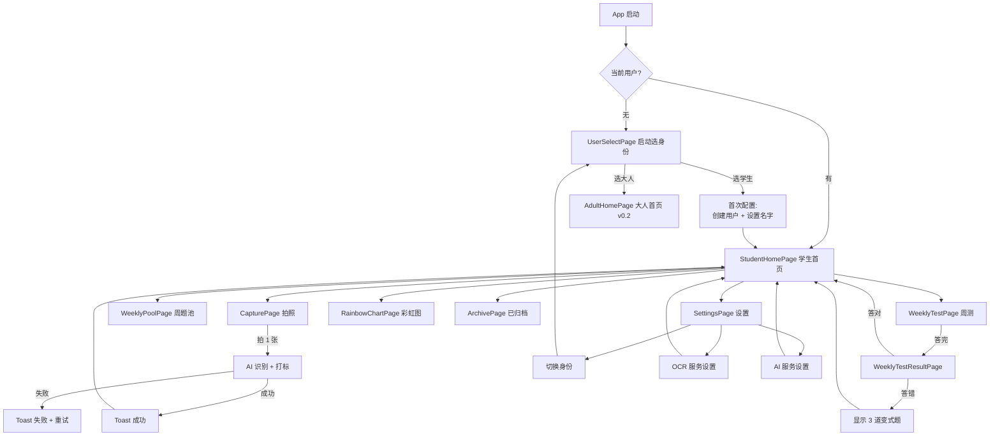

# 交互流程设计 — AI智能学习机 v0.1

> **文档版本**：v0.1.0  
> **编制日期**：2026-06-06  
> **前置依赖**：Stage 1 需求 + Stage 2 技术方案 + Stage 3 系统架构  
> **目标**：v0.1 所有页面的用户故事 + 页面跳转流程

---

## 1. 设计原则

| 原则 | 实现 |
|:-----|:-----|
| **5 岁小孩能上手** | 大按钮（最小 56pt）、少文字、emoji 引导、点击区域 ≥ 44pt |
| **少操作多结果** | 一键拍照 = 自动识别打标入库；一键看周测 = 自动出题 |
| **即时反馈** | 拍照后 1 秒内显示识别结果 + 知识点 |
| **正向激励** | 答对 = 绿色动画 + 鼓励语；答错 = 蓝色提示（不强调失败）|
| **数据可见** | 知识彩虹图让孩子看到"掌握了多少" |
| **成人也能用** | 设置/报告页专业感；数据列表可筛可选 |

---

## 2. 用户故事（Persona）

### 2.1 主要用户：公子儿子（小学生 8-12 岁）

**目标**：把错题/漏题快速归类，AI 帮他复习掌握

**核心故事**：

| # | 故事 | 触达页面 | 期望 |
|:-:|:-----|:---------|:-----|
| 1 | 做完作业发现 3 道错题 | 拍照 → 识别 → 入库 | 一拍就完，5 秒搞定 |
| 2 | 周末收到周测通知 | 通知 → 周测页 | 1 分钟内做完 5 道题 |
| 3 | 答错 1 道 | 周测结果页 | 看到 3 道变式题（不是单纯"错"）|
| 4 | 想看自己掌握情况 | 知识彩虹图 | 看到红/黄/绿 + 数字 |
| 5 | 妈想换大人用 | 设置 → 切换 | 2 步完成 |

### 2.2 次要用户：公子（大人 30+）

**目标**：拍书生成读书笔记 / 看孩子学情

**核心故事**（v0.2 推）：

| # | 故事 | 触达页面 |
|:-:|:-----|:---------|
| 1 | 读完一章想记笔记 | 拍书 → 摘要 → 笔记 |
| 2 | 看孩子本周学情 | 报告页 |

---

## 3. 页面跳转总览（v0.1）



---

## 4. 关键页面交互流程

### 4.1 启动 → 选身份（v0.1 必做）

```
[App 启动]
  ↓
[检查本地数据库：有 current_user_id?]
  ├── 无 → UserSelectPage
  └── 有 → StudentHomePage（按 role 路由）

UserSelectPage 页面内容：
┌────────────────────────────────┐
│         📚 AI智能学习机           │
│                                  │
│      你好，请选择身份              │
│                                  │
│  ┌──────────────────────────┐  │
│  │   🎒 我是学生              │  │  大按钮 (200pt 高)
│  └──────────────────────────┘  │
│  ┌──────────────────────────┐  │
│  │   👨 我是大人              │  │
│  └──────────────────────────┘  │
│                                  │
│   [设置] (右上角图标)             │
└────────────────────────────────┘

[点击"我是学生"]
  ├── 本地无该用户 → 输入名字弹窗 → 创建
  └── 本地有该用户 → 直接进入 StudentHomePage
```

**关键交互**：
- 启动选身份页**不登录**（无密码）—— 多人共用 1 台 iPad 的设计
- 用户列表（v0.2+）可看到所有用户
- 切换身份在 SettingsPage

### 4.2 拍照录入错题（v0.1 核心流程）

```
StudentHomePage 点击 [📷 拍错题] 大按钮
  ↓
CapturePage 拍照页
  ├── 顶部 Tab: [错题] [漏题]（默认"错题"）
  ├── 中央：相机预览框（圆形框 + 引导线）
  ├── 底部：[📷 拍照]（大圆按钮 100pt）
  └── 副按钮：[从相册选]
  ↓
[用户拍照 / 选图]
  ↓
[Loading 状态：识别中...]
  - 显示进度条 + "AI 正在识别..."
  - 预计 1-3 秒
  ↓
[识别完成弹窗]
  ┌────────────────────────┐
  │  ✅ 识别成功！            │
  │                          │
  │  题目：1/2 + 1/3 = ?     │
  │                          │
  │  📍 知识点：异分母分数加法 │
  │  ❌ 错误类型：计算错       │
  │  📖 章节：分数运算         │
  │                          │
  │  [确认入库]  [重新拍]     │
  └────────────────────────┘
  ↓
[确认入库] → Repository.save() → 删除原图（默认）→ 返回首页
[重新拍] → 回到拍照页
  ↓
[首页 Toast] "🎉 新错题已加入本周错题池"
```

**关键交互**：
- 拍照后**立即**显示识别结果（不等用户点"识别"）
- 识别失败可重试（自动 2 次 + 手动重试 1 次）
- 题目文本/知识点可编辑（万一 AI 识别错了）
- 图片默认识别后删（设置可改"保留 N 天"）

### 4.3 知识彩虹图（v0.1 必做）

```
StudentHomePage 点击 [🌈 我的掌握] 按钮
  ↓
RainbowChartPage
  ├── 顶部：统计数字
  │   "你已掌握 18 个知识点 🌟"
  │   "本周新增 5 道错题"
  │   "待周测 3 道"
  ├── 中部：3 大块（红/黄/绿）
  │   ┌──────────┬──────────┬──────────┐
  │   │ 🔴 未掌握  │ 🟡 不稳定 │ 🟢 已掌握 │
  │   │   3 个    │   5 个    │  18 个    │
  │   │  [列表]   │  [列表]   │  [列表]   │
  │   └──────────┴──────────┴──────────┘
  │   每个色块内：知识点卡片
  │   - 名称: "异分母分数加法"
  │   - 错题数: "2 道"
  │   - 状态: "本周待练" / "已通过周测" / "已归档"
  └── 点击色块展开知识点列表
```

**关键交互**：
- 颜色用 fl_chart 柱状图渲染
- 知识点卡片**可点击**看详情（v0.1 简化为错题列表）
- 顶部数字让孩子看到"成就"

### 4.4 周测答题（v0.1 必做）

```
StudentHomePage 收到通知
  或
StudentHomePage 点击 [📝 本周周测] 按钮
  ↓
WeeklyTestPage
  ├── 进度条 "第 3 / 5 题"
  ├── 题目文本（可滚动）
  ├── 选项区域（4 个大按钮）
  │   ┌──────────┐
  │   │   A. 1/2 │
  │   ├──────────┤
  │   │   B. 5/6 │
  │   ├──────────┤
  │   │   C. 2/3 │
  │   ├──────────┤
  │   │   D. 1/4 │
  │   └──────────┘
  └── 底部：[上一题] [下一题 / 提交]
  ↓
[答完 5 道]
  ↓
WeeklyTestResultPage
  ├── 顶部动画：🎉 答对 N / 5
  ├── 答对的题：绿色 + 简短说明
  ├── 答错的题：蓝色 + "已自动生成 3 道变式题"
  │              "下周继续练 💪"
  └── [返回首页]
  ↓
[返回 StudentHomePage]
```

**关键交互**：
- 答错**不显示"红 X"**，显示**蓝色提示**（避免挫败感）
- 自动生成变式题后**显示题数**（"3 道新题"），不显示具体题（v0.2 在周题池里看）
- 周测完**有成就动画**（v0.1 简化为 "🎉" emoji）

### 4.5 设置页（v0.1 必做）

```
SettingsPage
  ├── 用户设置
  │   ├── 当前用户：👦 儿子
  │   ├── [切换身份] → UserSelectPage
  │   └── [添加用户]（v0.2 推）
  ├── OCR 服务
  │   ├── 默认：百度云教育版
  │   ├── [切换到 Apple Vision]（fallback）
  │   └── [测试识别]（拍 1 张图试）
  ├── AI 服务
  │   ├── 默认：DeepSeek
  │   └── [切换到 Claude]（v0.2 推）
  ├── 图片保留
  │   ├── [默认：识别后立即删] ⚠️
  │   ├── 保留 7 天
  │   ├── 保留 30 天
  │   └── 永久保留
  └── 关于
      ├── 版本：v0.1.0
      └── [查看技术栈]
```

**关键交互**：
- 图片默认行为**加 ⚠️ 警告标识**，用户主动改
- OCR 测试：拍 1 张图，2 秒内出结果

---

## 5. 通知流程（v0.1）

| 时机 | 通知 | 操作 |
|:-----|:-----|:-----|
| 周六 8:00 | "📝 本周错题歼灭战已就绪，5 道题等你挑战" | 点击 → WeeklyTestPage |
| 录入新错题 | （无通知，首页 Toast）| - |
| 答错变式题生成 | （无通知，首页 Banner）| - |
| OCR 失败 | "❌ 识别失败，点击重试" | 点击 → CapturePage |
| AI 私教推送（v0.2）| "🎓 你需要复习 [知识点]，已生成讲解卡" | 点击 → TutorCardPage |

---

## 6. 错误与异常交互

| 场景 | 表现 | 用户可做 |
|:-----|:-----|:---------|
| 拍照权限被拒 | 引导页："请在设置中允许相机权限" | [去设置] |
| 网络断开 | 拍照页底部 Banner："当前无网络" | 继续拍（v0.2 离线推）|
| OCR 失败 3 次 | 拍照页："识别失败，请手动输入" | [手动输入] / [重试] |
| AI 输出异常 | 周测结果页："AI 异常，已自动重试 2 次" | [重试] |
| 数据库错误 | 全屏错误页："数据异常，请重启 App" | [重启] |

---

## 7. 动效与微交互

| 场景 | 动效 |
|:-----|:-----|
| 答对 | 绿色 ✓ 弹入 + 简短振动 |
| 答错 | 蓝色 → 提示文字淡入 |
| 拍照后识别 | Loading 旋转 + "AI 正在识别..." 文案 |
| 周测完成 | 🎉 撒花 + 数字滚动 |
| 知识彩虹图 | 进入页面时柱状图从 0 长到目标值（0.5s）|
| 切换身份 | 页面左滑切换 |

---

## 8. 离线 vs 在线（v0.1 简化）

| 功能 | v0.1 行为 |
|:-----|:---------|
| 拍照 | **必须联网**（OCR 调云）|
| 看历史题 | 离线可看（本地 SQLite）|
| 周测答题 | 离线可答，提交时暂存 |
| 周测提交 | **必须联网**（AI 生成变式题）|
| 知识彩虹图 | 离线可看（本地数据）|

---

## 9. v0.2 推的流程（仅占位）

- 拍书录入（大人模块）
- 月测流程
- AI 私教讲解卡
- 学情报告导出
- 知识图谱交互

---

## 10. 自查报告

| 自查项 | 结果 |
|:-----|:-----|
| v0.1 页面全列 | ✅（9 个页面）|
| 跳转图完整 | ✅ |
| 用户故事覆盖 | ✅（学生 5 + 大人 2）|
| 拍照/周测/彩虹图核心流程 | ✅ |
| 通知流程 | ✅ |
| 错误/异常交互 | ✅ |
| 动效 | ✅ |
| 离线/在线 | ✅ |