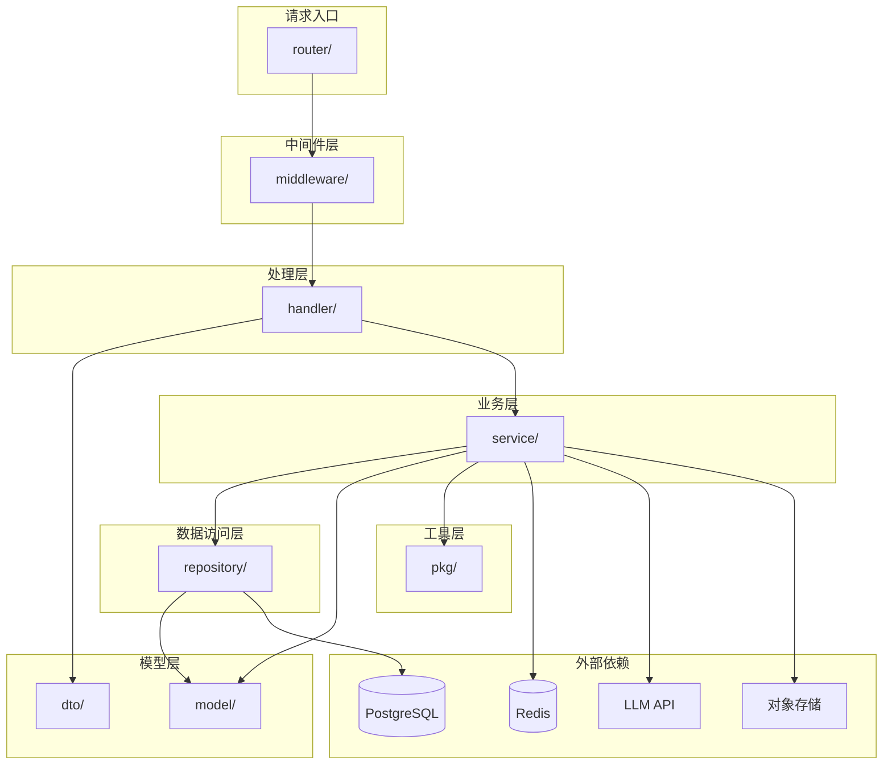

# 目录结构 — 智能学习软件

> 版本：v1.0.0
> 语言：Go
> 框架：Gin + GORM
> 架构风格：Clean Architecture（分层架构）

---

## 1. 项目根目录结构

```
smart-learning/
├── cmd/                          # 应用程序入口
│   └── server/
│       └── main.go               # 服务启动入口
│
├── internal/                     # 内部应用代码
│   ├── handler/                  # HTTP 处理器层（接收请求、校验参数、响应）
│   │   ├── auth_handler.go       # 认证相关接口
│   │   ├── user_handler.go       # 用户管理接口
│   │   ├── plan_handler.go       # 学习计划接口
│   │   ├── exercise_handler.go   # 练习接口
│   │   ├── mistake_handler.go    # 错题接口
│   │   ├── report_handler.go     # 学习报告接口
│   │   ├── subject_handler.go    # 科目接口
│   │   ├── knowledge_handler.go  # 知识点接口
│   │   ├── question_handler.go   # 题目管理接口
│   │   └── upload_handler.go     # 文件上传接口
│   │
│   ├── service/                  # 业务逻辑层
│   │   ├── auth_service.go       # 认证服务（登录/注册/Token 管理）
│   │   ├── user_service.go       # 用户服务
│   │   ├── plan_service.go       # 学习计划服务
│   │   ├── exercise_service.go   # 练习服务
│   │   ├── mistake_service.go    # 错题服务
│   │   ├── report_service.go     # 学习报告服务
│   │   ├── subject_service.go    # 科目服务
│   │   ├── knowledge_service.go  # 知识点服务
│   │   ├── question_service.go   # 题目服务
│   │   ├── upload_service.go     # 文件上传服务
│   │   ├── ai_service.go         # AI 服务（LLM 网关 + 降级引擎）
│   │   └── cache_service.go      # 缓存服务
│   │
│   ├── repository/               # 数据访问层（GORM 操作）
│   │   ├── user_repo.go          # 用户数据操作
│   │   ├── plan_repo.go          # 学习计划数据操作
│   │   ├── exercise_repo.go      # 练习记录数据操作
│   │   ├── mistake_repo.go       # 错题数据操作
│   │   ├── report_repo.go        # 学习报告数据操作
│   │   ├── subject_repo.go       # 科目数据操作
│   │   ├── knowledge_repo.go     # 知识点数据操作
│   │   ├── question_repo.go      # 题目数据操作
│   │   └── log_repo.go           # 操作日志数据操作
│   │
│   ├── model/                    # 数据模型（GORM Model 定义）
│   │   ├── user.go               # 用户模型
│   │   ├── subject.go            # 科目模型
│   │   ├── knowledge_point.go    # 知识点模型
│   │   ├── question.go           # 题目模型
│   │   ├── study_plan.go         # 学习计划模型
│   │   ├── study_record.go       # 学习记录模型
│   │   ├── exercise_record.go    # 练习记录模型
│   │   ├── mistake_book.go       # 错题本模型
│   │   ├── study_report.go       # 学习报告模型
│   │   └── operation_log.go      # 操作日志模型
│   │
│   ├── middleware/               # HTTP 中间件
│   │   ├── auth.go               # JWT 认证中间件
│   │   ├── role.go               # 角色权限中间件
│   │   ├── cors.go               # 跨域中间件
│   │   ├── logger.go             # 请求日志中间件
│   │   ├── recovery.go           # 异常恢复中间件
│   │   ├── ratelimit.go          # 限流中间件
│   │   └── request_id.go         # 请求 ID 注入
│   │
│   ├── router/                   # 路由注册
│   │   ├── router.go             # 总路由入口
│   │   ├── auth_routes.go        # 认证模块路由
│   │   ├── user_routes.go        # 用户模块路由
│   │   ├── plan_routes.go        # 学习规划模块路由
│   │   ├── exercise_routes.go    # 练习模块路由
│   │   ├── mistake_routes.go     # 错题模块路由
│   │   ├── report_routes.go      # 看板模块路由
│   │   ├── content_routes.go     # 内容管理模块路由
│   │   └── knowledge_routes.go   # 知识图谱模块路由
│   │
│   ├── config/                   # 配置读取
│   │   ├── config.go             # 配置结构体定义
│   │   ├── config.yaml           # 默认配置文件
│   │   └── env.go                # 环境变量绑定
│   │
│   └── dto/                      # Data Transfer Object（请求/响应结构体）
│       ├── request/
│       │   ├── auth_req.go       # 认证请求
│       │   ├── user_req.go       # 用户请求
│       │   ├── plan_req.go       # 计划请求
│       │   ├── exercise_req.go   # 练习请求
│       │   └── mistake_req.go    # 错题请求
│       └── response/
│           ├── common.go         # 通用响应结构体（分页/错误码）
│           ├── auth_resp.go      # 认证响应
│           ├── user_resp.go      # 用户响应
│           ├── plan_resp.go      # 计划响应
│           ├── exercise_resp.go  # 练习响应
│           ├── mistake_resp.go   # 错题响应
│           └── report_resp.go    # 报告响应
│
├── pkg/                          # 可复用工具包
│   ├── jwt/                      # JWT 工具
│   │   └── jwt.go
│   ├── hash/                     # 密码哈希工具（bcrypt）
│   │   └── hash.go
│   ├── response/                 # 统一响应工具
│   │   └── response.go
│   ├── validator/                # 参数校验工具
│   │   └── validator.go
│   ├── pagination/               # 分页工具
│   │   └── pagination.go
│   ├── oss/                      # 对象存储客户端
│   │   └── oss.go
│   └── logger/                   # 日志工具
│       └── logger.go
│
├── api/                          # API 定义文档
│   └── openapi.yaml              # OpenAPI 3.0 规范（可选）
│
├── configs/                      # 环境配置文件
│   ├── config.dev.yaml           # 开发环境配置
│   ├── config.prod.yaml          # 生产环境配置
│   └── config.test.yaml          # 测试环境配置
│
├── scripts/                      # 构建与部署脚本
│   ├── migrate.sh                # 数据库迁移脚本
│   ├── seed.sh                   # 种子数据脚本
│   ├── backup.sh                 # 数据库备份脚本
│   └── deploy.sh                 # 部署脚本
│
├── migrations/                   # 数据库迁移文件
│   ├── 000001_create_users_table.up.sql
│   ├── 000001_create_users_table.down.sql
│   ├── 000002_create_subjects_table.up.sql
│   ├── 000002_create_subjects_table.down.sql
│   ├── 000003_create_knowledge_points_table.up.sql
│   ├── 000003_create_knowledge_points_table.down.sql
│   ├── 000004_create_questions_table.up.sql
│   ├── 000004_create_questions_table.down.sql
│   ├── 000005_create_study_plans_table.up.sql
│   ├── 000005_create_study_plans_table.down.sql
│   ├── 000006_create_study_records_table.up.sql
│   ├── 000006_create_study_records_table.down.sql
│   ├── 000007_create_exercise_records_table.up.sql
│   ├── 000007_create_exercise_records_table.down.sql
│   ├── 000008_create_mistake_books_table.up.sql
│   ├── 000008_create_mistake_books_table.down.sql
│   ├── 000009_create_study_reports_table.up.sql
│   ├── 000009_create_study_reports_table.down.sql
│   └── 000010_create_operation_logs_table.up.sql
│   └── 000010_create_operation_logs_table.down.sql
│
├── docs/                         # 项目文档
│   ├── requirements/             # 需求文档
│   ├── research/                 # 技术调研文档
│   └── design/                   # 系统设计文档（当前产出）
│
├── Dockerfile                    # 多阶段构建 Dockerfile
├── docker-compose.yml            # Docker Compose 编排
├── Makefile                      # 项目构建命令
├── go.mod                        # Go Module 定义
├── go.sum                        # 依赖校验文件
├── .env.example                  # 环境变量模板
├── .gitignore                    # Git 忽略规则
└── README.md                     # 项目说明
```

---

## 2. 分层架构依赖关系



### 依赖方向（禁止反向依赖）

```
handler → service → repository → model
     ↘         ↘          ↘
      dto      pkg/       DB
               cache
               LLM
               OSS
```

**层间依赖规则：**
| 规则 | 说明 |
|:-----|:------|
| handler 只调用 service | handler 不直接调用 repository |
| service 调用 repository | service 不直接操作数据库 |
| repository 操作数据库 | 使用 GORM，与 model 交互 |
| model 被所有层引用 | 纯数据结构，不包含业务逻辑 |
| dto 只被 handler 引用 | 请求/响应的序列化结构 |
| pkg 可被任何层引用 | 工具函数，无业务语义 |

---

## 3. 模块文件映射

| 业务模块 | handler | service | repository | model | router |
|:---------|:--------|:--------|:-----------|:------|:-------|
| 认证 | auth_handler.go | auth_service.go | user_repo.go | user.go | auth_routes.go |
| 用户 | user_handler.go | user_service.go | user_repo.go | user.go | user_routes.go |
| 学习规划 | plan_handler.go | plan_service.go | plan_repo.go | study_plan.go, study_record.go | plan_routes.go |
| 练习 | exercise_handler.go | exercise_service.go | exercise_repo.go | exercise_record.go, question.go | exercise_routes.go |
| 错题 | mistake_handler.go | mistake_service.go | mistake_repo.go | mistake_book.go | mistake_routes.go |
| 看板/报告 | report_handler.go | report_service.go | report_repo.go | study_report.go | report_routes.go |
| 内容管理 | question_handler.go, subject_handler.go, knowledge_handler.go | question_service.go, subject_service.go, knowledge_service.go | question_repo.go, subject_repo.go, knowledge_repo.go | question.go, subject.go, knowledge_point.go | content_routes.go |
| 知识图谱 | — | knowledge_service.go | knowledge_repo.go | knowledge_point.go | knowledge_routes.go |
| AI | — | ai_service.go | — | — | — |
| 缓存 | — | cache_service.go | — | — | — |
| 上传 | upload_handler.go | upload_service.go | — | — | — |

---

## 4. 关键文件职责说明

### 4.1 `cmd/server/main.go`

```go
// 职责：应用启动入口
// 1. 加载配置
// 2. 初始化数据库连接
// 3. 初始化 Redis 连接
// 4. 初始化 OSS 客户端
// 5. 执行数据库迁移
// 6. 注册路由
// 7. 启动 HTTP 服务
```

### 4.2 `internal/handler/*.go`

```go
// 职责：请求入口
// - 校验请求参数（绑定 JSON/Query/URI）
// - 调用 service 层处理业务
// - 组装响应返回
// - 不包含业务逻辑
```

### 4.3 `internal/service/*.go`

```go
// 职责：业务逻辑编排
// - 组合多 repository 调用
// - 调用外部服务（AI/OSS）
// - 缓存读写策略
// - 事务管理
// - 业务规则校验
```

### 4.4 `internal/repository/*.go`

```go
// 职责：数据持久化
// - GORM CRUD 操作
// - 复杂查询组装
// - 不包含业务逻辑
```

### 4.5 `internal/middleware/auth.go`

```go
// 职责：JWT 认证
// 1. 从 Authorization Header 提取 Token
// 2. 校验 Token 有效性
// 3. 将 user_id, role 注入 gin.Context
// 4. 未认证请求返回 401
```

---

## 5. 配置文件结构

### 5.1 配置加载优先级

```
环境变量 > config.{env}.yaml > 默认值
```

### 5.2 配置结构体

```go
type Config struct {
    Server   ServerConfig
    Database DatabaseConfig
    Redis    RedisConfig
    JWT      JWTConfig
    OSS      OSSConfig
    AI       AIConfig
    Logger   LoggerConfig
}

type ServerConfig struct {
    Port         int
    Mode         string     // debug / release / test
    ReadTimeout  time.Duration
    WriteTimeout time.Duration
}

type DatabaseConfig struct {
    Host         string
    Port         int
    User         string
    Password     string
    DBName       string
    SSLMode      string
    MaxOpenConns int
    MaxIdleConns int
    MaxLifetime  time.Duration
}

type RedisConfig struct {
    Host     string
    Port     int
    Password string
    DB       int
}

type JWTConfig struct {
    Secret            string
    AccessTokenTTL    time.Duration   // 2h
    RefreshTokenTTL   time.Duration   // 7d
}

type OSSConfig struct {
    Endpoint   string
    AccessKey  string
    SecretKey  string
    BucketName string
}

type AIConfig struct {
    APIKey      string
    APIURL      string
    Model       string
    Timeout     time.Duration
    MaxRetries  int
    CacheTTL    time.Duration
}
```

### 5.3 环境变量

```bash
# 服务配置
SERVER_PORT=8080
SERVER_MODE=release

# 数据库
DB_HOST=localhost
DB_PORT=5432
DB_USER=smart_learning
DB_PASSWORD=<password>
DB_NAME=smart_learning

# Redis
REDIS_HOST=localhost
REDIS_PORT=6379
REDIS_PASSWORD=<password>

# JWT
JWT_SECRET=<random-64-chars>

# OSS
OSS_ENDPOINT=oss-cn-hangzhou.aliyuncs.com
OSS_ACCESS_KEY=<access-key>
OSS_SECRET_KEY=<secret-key>
OSS_BUCKET=smart-learning-assets

# AI
AI_API_KEY=<api-key>
AI_API_URL=https://dashscope.aliyuncs.com/api/v1
AI_MODEL=qwen-plus
```

---

## 6. Makefile 命令

```makefile
# 开发
make dev            # 启动开发服务器（air 热重载）
make build          # 编译二进制
make test           # 运行单元测试
make lint           # 代码检查

# 数据库
make migrate-up     # 执行数据库迁移
make migrate-down   # 回滚数据库迁移
make seed           # 导入种子数据
make db-backup      # 备份数据库

# Docker
make docker-build   # 构建 Docker 镜像
make docker-up      # 启动 Docker Compose
make docker-down    # 停止 Docker Compose

# 部署
make deploy         # 一键部署
```

---

## 7. 目录结构设计决策

| DEC 编号 | 决策项 | 理由 |
|:---------|:-------|:------|
| DEC-013 | 采用 Clean Architecture 分层架构 | 职责分离、可测试性强、模块间松耦合 |
| DEC-014 | 按模块分包（handler/service/repo 各自独立文件） | 避免巨型文件，按业务维度组织代码 |
| DEC-015 | `pkg/` 独立目录存放通用工具 | 可复用、无业务语义，未来可提取为独立库 |
| DEC-016 | `dto/` 独立目录区分请求/响应 | 隔离外部协议与内部模型，支持 API 版本演进 |
| DEC-017 | `migrations/` 使用版本化 SQL 文件 | 支持 CI/CD 自动化迁移，回滚可追溯 |
| DEC-018 | 配置文件使用 yaml + 环境变量覆盖 | 开发/测试/生产环境配置分离，安全敏感信息走环境变量 |