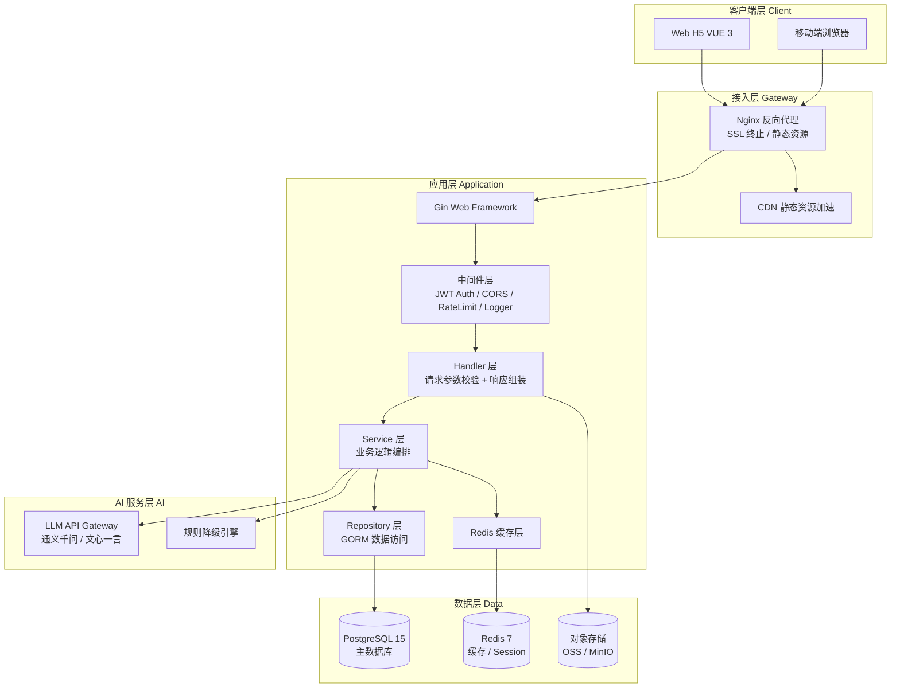
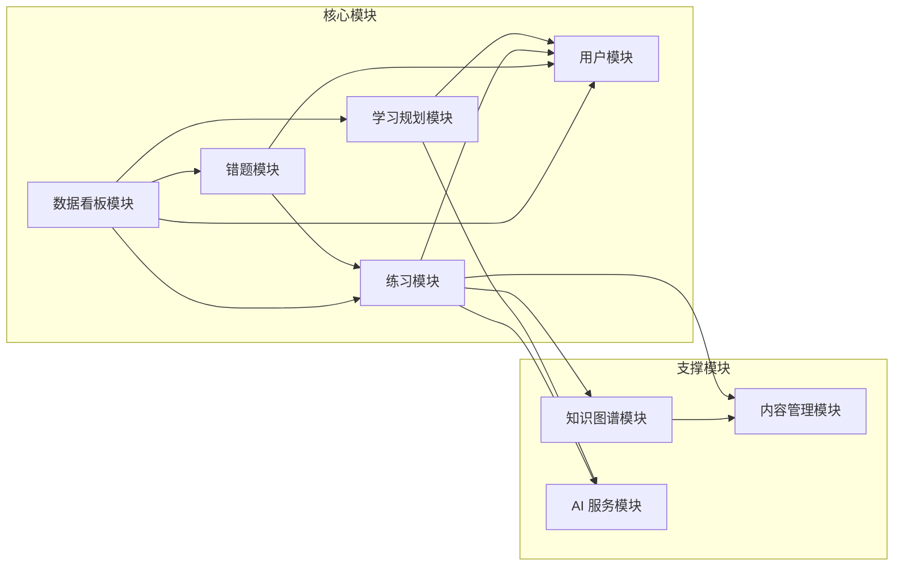
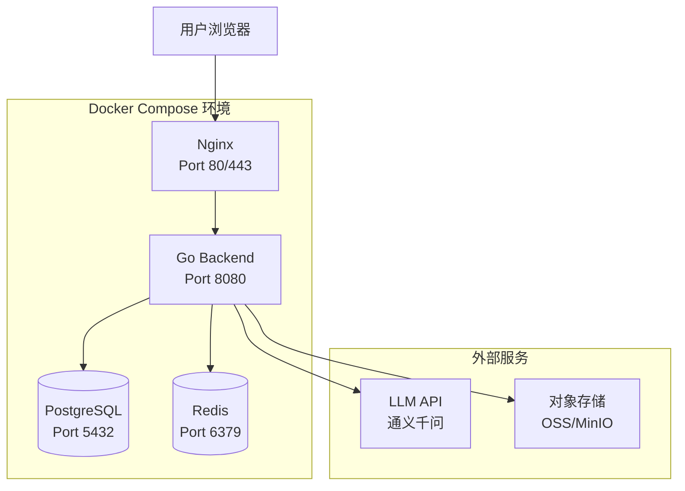

# 系统架构设计 — 智能学习软件

> 版本：v1.0.0
> 对应需求规格说明书：v1.0.0
> 对应技术方案说明书：v1.0.0

---

## 1. NFR 驱动扫描

### 1.1 NFR 检查表

| 检查项 | 触发关键词 | 是否触发 | 架构响应 |
|:-------|:----------|:---------|:---------|
| 高并发 | 1000 人同时在线 | ✅ NF-04 | Redis 缓存热点数据 + 连接池 + 异步报告生成 |
| 实时通信 | 实时答题反馈（≤1s） | ✅ NF-02 | 同步 REST 响应 + 缓存题目数据 |
| 大数据量 | — | ❌ | MVP 阶段单表量可控，无需分片 |
| 文件存储 | 头像上传 | ✅ F-02 | 对象存储（OSS/MinIO）+ CDN |
| 第三方集成 | 微信/QQ 登录 | ✅ NF-19 | OAuth 2.0 适配层 |
| 多租户 | — | ❌ | 不支持多租户模式 |
| 数据合规 | 隐私保护、日志追溯 | ✅ NF-10, NF-16 | HTTPS + 数据脱敏 + 操作日志 |
| 跨平台 | 移动端H5 | ✅ NF-13 | 响应式前端 + RESTful API |
| 定时任务 | 学习报告生成 | 潜在 | 异步任务队列 |
| 缓存需求 | 推荐结果、热点数据 | ✅ | Redis 缓存（TTL 策略） |
| AI 集成 | LLM 推荐、排课 | ✅ | LLM 网关 + 规则降级 + 缓存 |

### 1.2 NFR 驱动的架构决策

| 决策 | 对应 NFR | 方案 |
|:-----|:---------|:-----|
| 引入 Redis 缓存 | NF-02（≤1s 响应）、NF-04（1000 并发） | 缓存题目、推荐结果 |
| 使用异步报告生成 | NF-03（≤3s 报告生成） | 报告预先计算 + redis 缓存 |
| JWT 双 Token 机制 | NF-08（认证鉴权） | access_token 2h + refresh_token 7d |
| LLM 熔断降级 | NF-05（≤3s AI 响应） | 规则引擎降级 + 缓存 + 熔断器 |
| bcrypt 密码加密 | NF-06 密码安全 | cost=10 |

---

## 2. 整体系统架构

### 2.1 架构分层图



### 2.2 架构设计决策

| DEC 编号 | 决策项 | 决策 | 备选方案 | 理由 | 影响范围 |
|:---------|:-------|:-----|:---------|:-----|:---------|
| DEC-001 | 应用架构模式 | **单体应用**（MVP 阶段） | 微服务 | MVP 阶段 7 个模块耦合度低，单体足以支撑；后期可按模块拆微服务 | 全部模块 |
| DEC-002 | Web 框架 | **Gin** | Echo / Fiber | 社区最大、中间件生态丰富、团队熟悉（见技术方案 2.1） | Handler/Middleware |
| DEC-003 | ORM | **GORM** | Ent / sqlx | 功能全面、自动迁移、与 Gin 生态契合（见技术方案 2.2） | Repository 层 |
| DEC-004 | 数据库 | **PostgreSQL 15** | MySQL | JSONB + 数组类型 + 全文检索 + 强 ACID（见技术方案 3.1） | 数据模型 |
| DEC-005 | 缓存 | **Redis 7** | — | 缓存热点数据 + LLM 推荐结果 + 限流计数器 | Service 层 |
| DEC-006 | 认证方案 | **JWT（双 Token）** | Session | 无状态后端、支持跨域、适合前后端分离 | Middleware |
| DEC-007 | API 风格 | **RESTful JSON** | GraphQL | 简单清晰、生态成熟、满足 MVP 需求 | 全部 API |
| DEC-008 | 部署方式 | **Docker Compose** | K8s | 轻量级、满足 MVP 需求、低成本运维 | 运维 |
| DEC-009 | 对象存储 | **阿里云 OSS / MinIO** | 本地存储 | 可扩展性、CDN 加速、数据持久化 | 文件上传 |
| DEC-010 | AI 降级策略 | **规则引擎降级** | 纯 LLM | LLM 不可靠时保障核心功能可用 | 推荐/排课服务 |
| DEC-011 | 日志与监控 | **结构化日志 + Prometheus/Grafana** | ELK | 轻量级、Go 原生支持 | 全系统 |
| DEC-012 | 知识图谱结构 | **Adjacency List + Materialized Path 混合** | 纯递归 | 平衡查询效率与数据维护复杂度 | 知识点模块 |

---

## 3. 模块划分

### 3.1 模块清单

| 模块名称 | 职责 | 归属服务 | MVP 范围 |
|:---------|:-----|:---------|:---------|
| **用户模块** | 注册登录、个人中心、角色管理、家长绑定 | 单体应用 | ✅ |
| **学习规划模块** | 学习目标设定、智能排课、打卡、计划调整 | 单体应用 | ✅ |
| **练习模块** | 知识点练习、智能推荐、主观题批改、试卷生成、实时反馈 | 单体应用 | ✅ |
| **错题模块** | 自动收录、分类管理、错题重练、导出 | 单体应用 | ✅ |
| **数据看板模块** | 个人报告、掌握度雷达图、班级学情、趋势分析 | 单体应用 | ✅ |
| **知识图谱模块** | 知识图谱浏览、薄弱点推荐 | 单体应用 | ❌ (V1.5) |
| **内容管理模块** | 题库管理、知识点管理、资料上传 | 单体应用 | ❌ (V1.5) |
| **AI 服务模块** | LLM 网关、规则降级、推荐引擎 | 单体应用 | ✅ |

### 3.2 模块依赖关系



| 依赖关系 | 说明 |
|:---------|:------|
| 学习规划 → 用户 | 获取用户信息和时间约束 |
| 练习 → 用户 | 记录练习者身份 |
| 练习 → 知识图谱 | 按知识点出题 |
| 练习 → 内容管理 | 读取题目数据 |
| 错题 → 练习 | 从练习记录中收录错题 |
| 错题 → 用户 | 识别错题所属用户 |
| 看板 → 学习规划 | 读取计划完成数据 |
| 看板 → 练习 | 读取练习统计数据 |
| 看板 → 错题 | 读取错题统计数据 |
| 看板 → 用户 | 获取用户信息 |
| 规划 → AI | 调用排课推荐 |
| 练习 → AI | 调用薄弱点推荐 |
| 知识图谱 → 内容管理 | 读取知识点数据 |

### 3.3 模块间交互流程

**核心业务流：设定目标 → 获得计划 → 练习 → 错题巩固 → 看报告**

```
1. 用户设定学习目标
   └→ 学习规划模块调用 AI 服务生成计划 → 保存计划
   
2. 用户查看今日计划并打卡
   └→ 学习规划模块记录完成状态

3. 用户进入知识点练习
   └→ 练习模块调用 AI 服务推荐薄弱点
   └→ 练习模块从内容管理读取题目
   └→ 练习模块批改并返回结果
   └→ 错题模块自动收录错题

4. 用户查看错题本
   └→ 错题模块按知识点/时间分类展示
   └→ 错题重练 → 练习模块出题

5. 用户查看学习报告
   └→ 数据看板模块汇总各模块数据 → 生成报告
```

---

## 4. 关键技术决策

### 4.1 认证鉴权流程

```
用户登录 → 服务端验证凭证 → 生成 access_token(2h) + refresh_token(7d)
  → 前端 localStorage 存储 → 每次请求带 Authorization: Bearer <token>
  → JWT Middleware 校验 → 放行或拒绝
  → access_token 过期 → 使用 refresh_token 换取新 token
  → refresh_token 过期 → 重新登录
```

### 4.2 AI 服务调用流程

```
Service 层 → LLM Service
  ├─ 查 Redis 缓存 → hit → 返回缓存
  └─ miss → 调用 LLM API
      ├─ 成功 → 写入缓存 → 返回结果
      └─ 超时/失败 → 熔断器判断
          ├─ 熔断未开 → 规则降级引擎 → 返回降级结果
          └─ 熔断已开 → 直接规则降级
```

### 4.3 数据一致性策略

| 场景 | 策略 |
|:-----|:------|
| 用户注册 | 事务（用户表创建 + 默认计划初始化） |
| 练习提交 | 单表写入，无需事务 |
| 错题收录 | 幂等写入（重复错题只增加 mistake_count） |
| 报告生成 | 异步计算 + 缓存，允许秒级延迟 |

### 4.4 错误处理规范

| 错误类别 | HTTP 状态码 | 业务错误码示例 |
|:---------|:------------|:---------------|
| 参数校验失败 | 400 | 10001 |
| 认证失败 | 401 | 20001 |
| 权限不足 | 403 | 20002 |
| 资源不存在 | 404 | 30001 |
| 资源冲突 | 409 | 30002 |
| 限流 | 429 | 40001 |
| 服务错误 | 500 | 50001 |
| 第三方服务不可用 | 502 | 60001 |

---

## 5. 安全架构

| 安全维度 | 措施 |
|:---------|:------|
| 传输安全 | HTTPS / TLS 1.3 |
| 认证安全 | JWT 双 Token + bcrypt 密码加密 |
| 防注入 | GORM 参数化查询 + 输入净化 |
| 防 XSS | Gin 中间件 HTML 转义 |
| 权限控制 | JWT Claims 角色校验 + 中间件 |
| 数据隐私 | 个人信息加密存储 + 家长数据隔离 |
| 操作日志 | 用户操作记录 30 天可追溯 |
| 限流保护 | 基于 IP + UserID 的 Rate Limiter |

---

## 6. 部署架构



**容器配置**：
| 组件 | 镜像 | 建议资源 |
|:-----|:------|:---------|
| Nginx | nginx:alpine | 2 核 / 512MB |
| Go Backend | scratch（多阶段构建） | 4 核 / 1GB |
| PostgreSQL | postgres:15-alpine | 4 核 / 4GB |
| Redis | redis:7-alpine | 2 核 / 1GB |

---

## 7. API 概览

| 模块 | API 端点数 | 认证要求 |
|:-----|:-----------|:---------|
| 用户模块 | 8 | 注册/登录免认证，余需认证 |
| 学习规划模块 | 6 | 需认证 |
| 练习模块 | 6 | 需认证 |
| 错题模块 | 5 | 需认证 |
| 数据看板模块 | 4 | 需认证 |
| 知识图谱模块 | 3 | 需认证 (V1.5) |
| 内容管理模块 | 7 | 需认证 + 教师/管理员角色 |
| **合计** | **39** | — |

> 详见 `docs/design/API设计.md`

---

## 8. 架构评估

### 8.1 满足的 NFR 约束

| NFR | 满足方案 | 状态 |
|:----|:---------|:-----|
| NF-01 首屏 ≤2s | 静态资源 CDN + Nginx 缓存 + 前端懒加载 | ✅ |
| NF-02 批改 ≤1s | 预加载题目到 Redis + 同步响应 | ✅ |
| NF-03 报告 ≤3s | 预计算 + 缓存 + 异步生成 | ✅ |
| NF-04 1000 并发 | Redis 缓存 + 连接池（MaxOpen=100）+ Rate Limiter | ✅ |
| NF-05 AI ≤3s | 缓存 + 超时 + 熔断 + 规则降级 | ✅ |
| NF-06~NF-11 安全 | bcrypt + JWT + HTTPS + 角色权限 | ✅ |
| NF-12 99.5% | Docker 健康检查 + 容器自动重启 | ✅ |
| NF-13 移动端 | 响应式前端 | ✅ |
| NF-15 数据备份 | pg_dump 定时任务 | ✅ |
| NF-16 日志追溯 | 结构化日志 + 30 天轮转 | ✅ |
| NF-18 RESTful | RESTful JSON API | ✅ |
| NF-21 Docker | Docker Compose 编排 | ✅ |

### 8.2 已知局限（V1.5 改进）

| 局限 | 影响 | 改进方向 |
|:-----|:-----|:---------|
| 单体应用 | 模块间耦合度高，无法独立扩展 | 按模块拆微服务 |
| 无读写分离 | 数据库单点压力 | Pgpool-II 读写分离 |
| 无消息队列 | 异步任务缺乏缓冲 | 引入 RabbitMQ/NATS |
| 无监控告警 | 缺少系统可观测性 | Prometheus + Grafana + AlertManager |
