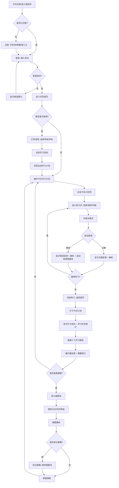
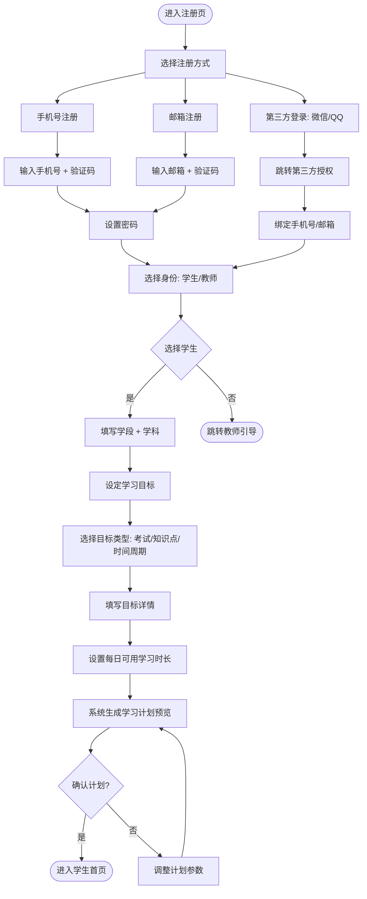
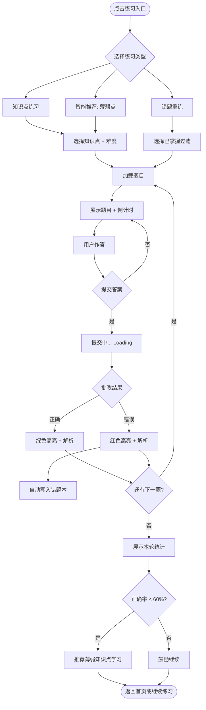
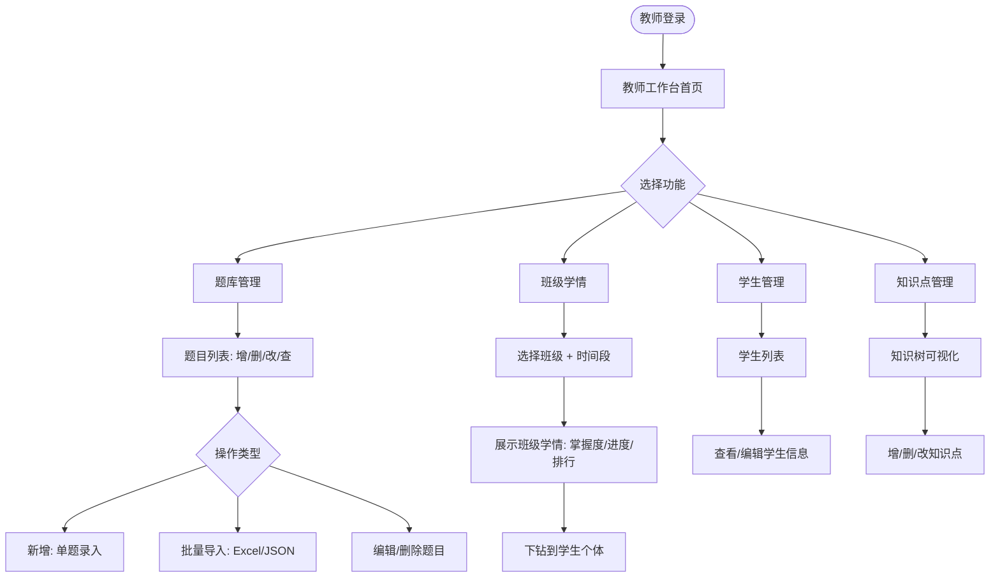
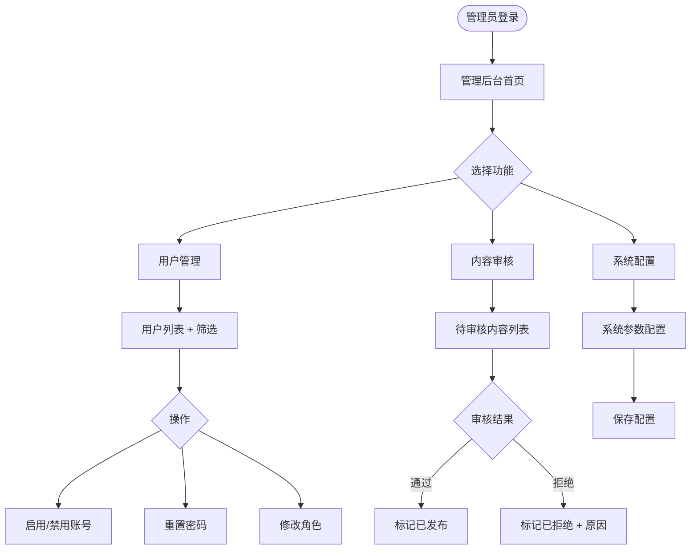
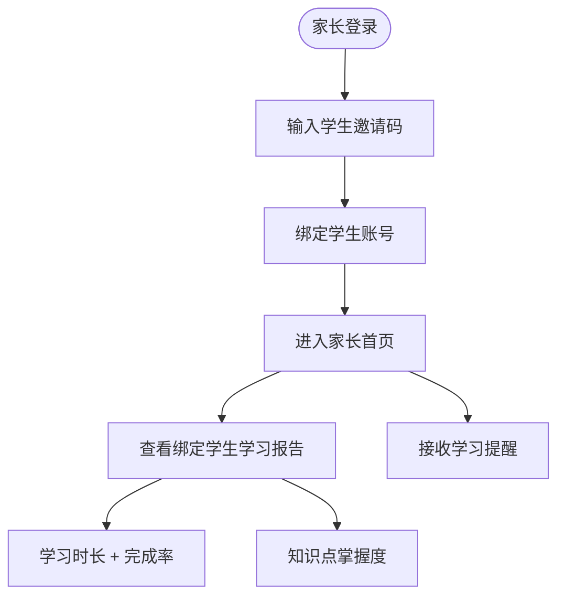

# 交互流程设计 — 智能学习软件

> 版本：v1.0.0
> 角色：UI/UX 设计师
> 阶段：D1 交互流程设计（PDCA）
> 对应需求：docs/requirements/需求规格说明书.md v1.0.0
> 对应技术方案：docs/research/技术方案说明书.md v1.0.0
> 前端技术：Vue 3 SPA + Vite + Element Plus（PC）+ Vant 4（移动端自适应）

---

## 1. 功能概述

本设计覆盖智能学习软件 MVP（V1.0）阶段的全部交互流程，目标是让学生可以完成"**设定目标 → 获得计划 → 练习做题 → 错题巩固 → 查看报告**"的完整学习闭环，同时为教师和管理员提供支撑性交互入口。

**MVP 范围覆盖：**
- F-01 注册/登录、F-02 个人中心
- F-05 学习目标设定、F-06 智能排课、F-07 计划打卡
- F-09 知识点练习、F-10 智能推荐、F-13 实时答题反馈
- F-14 自动收录错题、F-15 错题分类、F-16 错题重练
- F-18 个人学习报告、F-19 知识点掌握度雷达图

**V1.5+ 流程标注：**
V1.5（含角色切换、班级学情、题库管理、家长绑定）和 V2.0（学习社区）流程在本文中标注为**预留流程**，仅给出概要，待对应阶段细化。

---

## 2. 角色与场景

### 2.1 角色定义

| 角色 | 关键特征 | 典型使用场景 | 设备偏好 |
|:-----|:---------|:-------------|:---------|
| **学生** | K12/大学生，自主学习者 | 课前预习、课后练习、考试冲刺 | 移动端 H5 优先，PC 辅助 |
| **教师** | 学科教师、班主任 | 上传习题、查看班级学情、批改主观题 | PC 端为主，移动端查看通知 |
| **管理员** | 系统运维、运营 | 用户管理、内容审核、系统配置 | PC 端为主 |
| **家长**（P1，预留） | 中小学生家长 | 监督孩子学习进度、接收提醒 | 移动端 H5 优先 |

### 2.2 核心场景

| 场景编号 | 角色 | 场景描述 | 对应功能 |
|:---------|:-----|:---------|:---------|
| S-01 | 学生 | 新用户首次使用，注册并设定学习目标 | F-01, F-02, F-05 |
| S-02 | 学生 | 按照生成的每日计划学习并打卡 | F-06, F-07 |
| S-03 | 学生 | 进行知识点练习，并查看实时反馈 | F-09, F-13 |
| S-04 | 学生 | 智能推荐题目，攻克薄弱知识点 | F-10 |
| S-05 | 学生 | 错题整理、重练、标记掌握 | F-14, F-15, F-16 |
| S-06 | 学生 | 查看个人学习报告和掌握度雷达图 | F-18, F-19 |
| S-07 | 教师 | 登录后台，管理题库 | F-24（V1.5 预留）|
| S-08 | 教师 | 查看班级学情总览 | F-20（V1.5 预留）|
| S-09 | 管理员 | 用户管理与内容审核 | 管理后台（V1.5 预留）|

---

## 3. 用户流程图

### 3.1 学生主流程（MVP 核心闭环）



### 3.2 学生注册与目标设定流程（D1 子流程）



### 3.3 学生练习与错题流程



### 3.4 教师管理流程（V1.5 预留）



### 3.5 管理员流程（V1.5 预留）



### 3.6 家长流程（P1 预留）



---

## 4. 页面状态矩阵

每个页面都需定义 5 种状态：**加载中 / 空状态 / 错误状态 / 正常状态 / 边界状态**。

### 4.1 公共页面

| 页面 | 加载中 | 空状态 | 错误状态 | 正常状态 | 边界状态 |
|:-----|:-------|:-------|:---------|:---------|:---------|
| **登录页** | 按钮 loading 转圈 | — | 错误提示：账号密码错误/验证码过期 | 展示表单 + 登录按钮 | 多次失败锁定提示 |
| **注册页** | 发送验证码 loading | — | 验证码错误/手机号已注册 | 表单可交互 | 第三方登录授权失败回退 |
| **404 页** | — | — | — | 展示"页面不存在" + 返回首页 | — |

### 4.2 学生页面（MVP）

| 页面 | 加载中 | 空状态 | 错误状态 | 正常状态 | 边界状态 |
|:-----|:-------|:-------|:---------|:---------|:---------|
| **学生首页（今日计划）** | 骨架屏占位 | 暂无计划：引导设定目标按钮 | 网络错误 + 重试按钮 | 展示今日计划卡片列表 + 打卡按钮 | 计划已过期：灰色态 + 重新规划入口 |
| **学习目标设定** | 提交生成计划 loading | — | 生成失败：返回重新设定 | 表单可交互 + 计划预览 | 目标过于模糊：给出建议提示 |
| **学习计划预览** | 生成中（AI 加载动画） | — | AI 服务不可用：规则降级提示 | 展示每日计划卡片，可编辑调整 | 计划冲突：提示时间不够 |
| **练习页** | 加载题目 loading | 无可用题目：返回选择知识点 | 加载失败：重试按钮 | 展示题目 + 选项 + 提交按钮 | 倒计时归零：自动提交 + 提示 |
| **答题反馈** | 提交批改 loading | — | 批改失败：重试按钮 | 正确：绿色 + 解析；错误：红色 + 解析 + 错题收录提示 | 网络中断：本地保存答案，重连后提交 |
| **错题本列表** | 骨架屏 | 暂无错题：插画 + "继续保持" | 加载失败 + 重试 | 错题卡片列表 + 筛选器 | 已全部掌握：空态变体 + 重新练习入口 |
| **错题重练** | 加载题目 | 该知识点无未掌握错题 | 加载失败 | 题目列表 + 提交按钮 | 重练通过率 100%：自动标记掌握 |
| **学习报告** | 图表骨架屏 | 暂无数据：提示用户开始学习 | 加载失败 + 重试 | 关键指标卡片 + 雷达图 + 时长折线图 | 今日数据为 0：图表显示占位 |

### 4.3 教师/管理员页面（V1.5 预留）

| 页面 | 加载中 | 空状态 | 错误状态 | 正常状态 | 边界状态 |
|:-----|:-------|:-------|:---------|:---------|:---------|
| **教师工作台** | 骨架屏 | 暂无班级 | 加载失败 | 数据卡片 + 快捷入口 | — |
| **题库管理列表** | 表格 loading | 题库为空：引导新增 | 加载失败 | 表格 + 筛选 + 操作列 | 批量删除确认弹窗 |
| **班级学情** | 图表骨架屏 | 暂无学生数据 | 加载失败 | 班级平均掌握度图表 + 学生列表 | 班级人数为 0：提示 |
| **用户管理** | 表格 loading | 无用户数据 | 加载失败 | 用户表格 + 状态标签 + 操作 | 禁用账号二次确认 |

---

## 5. 交互点清单

### 5.1 公共交互

| # | 位置 | 元素 | 触发动作 | 预期响应 |
|:--|:-----|:-----|:---------|:---------|
| IP-01 | 顶部导航 | 头像 | 点击 | 弹出下拉菜单（个人中心/退出登录）|
| IP-02 | 全局 | 404 链接 | 点击 | 跳转首页 |
| IP-03 | 全局 | 网络异常提示条 | 自动出现 | 提示"网络异常，请检查"，恢复后自动消失 |

### 5.2 学生交互（MVP）

| # | 页面 | 元素 | 触发动作 | 预期响应 |
|:--|:-----|:-----|:---------|:---------|
| IP-04 | 学生首页 | "今日计划"卡片 | 点击 | 跳转对应练习页 |
| IP-05 | 学生首页 | "打卡"按钮 | 点击 | 弹出确认 → 提交 → 成功提示 + 累计打卡天数 |
| IP-06 | 学生首页 | "设定目标"按钮 | 点击 | 跳转目标设定流程 |
| IP-07 | 目标设定 | 目标类型 Radio | 切换 | 下方表单字段动态变化 |
| IP-08 | 目标设定 | "生成计划"按钮 | 点击 | loading → 计划预览页 |
| IP-09 | 计划预览 | 每日计划项 | 拖拽 | 调整顺序（V1.5 增强） |
| IP-10 | 计划预览 | "确认计划"按钮 | 点击 | 保存计划 → 跳转首页 |
| IP-11 | 练习页 | 选项 Radio | 选中 | 高亮选中状态 |
| IP-12 | 练习页 | "提交"按钮 | 点击 | loading → 批改结果展示 |
| IP-13 | 答题反馈 | "下一题"按钮 | 点击 | 加载下一题 |
| IP-14 | 答题反馈 | "查看解析"按钮 | 点击 | 展开解析详情 |
| IP-15 | 答题反馈 | "加入错题本"提示 | 自动出现 | 错误题目自动写入（无需用户操作）|
| IP-16 | 错题本 | 知识点筛选下拉 | 切换 | 列表过滤刷新 |
| IP-17 | 错题本 | "重练"按钮 | 点击 | 进入错题重练模式 |
| IP-18 | 错题重练 | "标记掌握"按钮 | 点击 | 确认弹窗 → 移除错题本 |
| IP-19 | 学习报告 | 周期切换 Tab | 切换 | 图表数据刷新（周/月）|
| IP-20 | 学习报告 | 雷达图 hover | 悬停 | 显示知识点详情 tooltip |

### 5.3 教师交互（V1.5 预留）

| # | 页面 | 元素 | 触发动作 | 预期响应 |
|:--|:-----|:-----|:---------|:---------|
| IP-21 | 教师工作台 | "题库管理"入口 | 点击 | 跳转题库列表 |
| IP-22 | 题库列表 | "新增题目"按钮 | 点击 | 弹出题目编辑抽屉/弹窗 |
| IP-23 | 题库列表 | "批量导入"按钮 | 点击 | 弹出导入向导（下载模板 → 上传 → 预览 → 提交）|
| IP-24 | 题库列表 | 题目操作列 | 点击编辑/删除 | 行内编辑/确认删除 |
| IP-25 | 班级学情 | 学生行 | 点击 | 下钻到学生个体报告 |
| IP-26 | 班级学情 | 知识点图表 | 点击 | 跳转知识点题目列表 |

### 5.4 管理员交互（V1.5 预留）

| # | 页面 | 元素 | 触发动作 | 预期响应 |
|:--|:-----|:-----|:---------|:---------|
| IP-27 | 用户管理 | "禁用/启用"按钮 | 点击 | 二次确认 → 状态切换 |
| IP-28 | 内容审核 | "通过/拒绝"按钮 | 点击 | 状态更新 + 列表刷新 |
| IP-29 | 内容审核 | "拒绝原因"输入 | 弹窗输入 | 必填项，提交后写入审核记录 |

---

## 6. 异常流程

### 6.1 网络异常

| 场景 | 触发条件 | 用户感知 | 恢复策略 |
|:-----|:---------|:---------|:---------|
| 网络断开 | 请求失败 / fetch reject | 全局顶部出现红色提示条"网络异常" | 网络恢复后自动重试 |
| 请求超时 | >10s 无响应 | loading 状态保持，提示"加载中" | 30s 后自动取消 + 错误弹窗 |
| 服务端 500 | HTTP 500 | 错误页 + 重试按钮 | 点击重试 → 重新发起请求 |
| JWT 过期 | 401 + token expired | 弹出登录失效提示，自动跳转登录页 | 登录后返回原页面 |

### 6.2 业务异常

| 场景 | 触发条件 | 用户感知 | 恢复策略 |
|:-----|:---------|:---------|:---------|
| AI 服务不可用 | LLM API 调用失败 | 提示"AI 服务暂不可用，已切换规则推荐" | 自动降级到规则引擎，1 小时后重试 |
| 题库为空 | 知识点下无题目 | 空状态插画 + "暂无可练习题目" | 引导切换其他知识点或反馈 |
| 计划冲突 | 目标设置超出可用时间 | 输入校验提示"学习时间不足，请调整目标" | 用户修改目标 |
| 学习数据丢失 | 本地缓存 + 服务器都无数据 | "暂无学习记录，去做几道题吧" | 引导开始第一次练习 |

### 6.3 权限异常

| 场景 | 触发条件 | 用户感知 | 恢复策略 |
|:-----|:---------|:---------|:---------|
| 越权访问 | 角色不匹配资源 | 403 错误页 + 返回首页 | 跳转登录或首页 |
| 家长查看未绑定学生 | 关系校验失败 | "您未绑定该学生" | 引导绑定流程 |

---

## 7. 组件层级树

> 详见《UI组件规范.md》。本节给出设计层级骨架。

```
应用根组件 (App)
├── 全局组件 (GlobalLayout)
│   ├── TopNavBar（顶部导航栏）
│   ├── SideNav（侧边栏 - PC 端）
│   ├── MobileTabBar（移动端底部 Tab）
│   ├── NetworkStatusBar（网络异常提示）
│   └── GlobalModal（全局弹窗）
├── 业务页面 (Pages)
│   ├── 公共页
│   │   ├── LoginPage
│   │   ├── RegisterPage
│   │   └── NotFoundPage
│   ├── 学生页（MVP）
│   │   ├── StudentHomePage（今日计划）
│   │   ├── GoalSettingPage（目标设定）
│   │   ├── PlanPreviewPage（计划预览）
│   │   ├── ExercisePage（练习页）
│   │   ├── AnswerFeedbackPage（答题反馈）
│   │   ├── MistakeBookPage（错题本）
│   │   ├── MistakeReplayPage（错题重练）
│   │   └── LearningReportPage（学习报告）
│   ├── 教师页（V1.5 预留）
│   │   ├── TeacherDashboardPage
│   │   ├── QuestionBankPage
│   │   ├── ClassReportPage
│   │   └── StudentManagePage
│   └── 管理员页（V1.5 预留）
│       ├── AdminDashboardPage
│       ├── UserManagePage
│       └── ContentReviewPage
```

---

## 8. 组件目录概览

> 详见《UI组件规范.md》。本节给出核心组件清单。

| 组件名 | 原子层级 | 主要用途 | 使用页面 |
|:-------|:---------|:---------|:---------|
| Button | 原子 | 触发操作 | 全局 |
| Input / TextArea | 原子 | 输入 | 登录、注册、表单 |
| Radio / Checkbox | 原子 | 选择 | 表单、答题 |
| Select | 原子 | 下拉选择 | 筛选、表单 |
| DatePicker | 原子 | 日期选择 | 目标设定、报告 |
| Card | 分子 | 容器 | 计划卡片、错题卡片 |
| Table | 组织体 | 列表展示 | 教师/管理员 |
| Modal / Drawer | 组织体 | 弹窗/抽屉 | 确认、新增、编辑 |
| Toast | 分子 | 提示反馈 | 全局 |
| Loading | 原子 | 加载状态 | 全局 |
| EmptyState | 分子 | 空状态 | 列表、报告 |
| ChartRadar | 组织体 | 雷达图 | 学习报告 |
| ChartLine | 组织体 | 折线图 | 学习报告 |
| QuestionCard | 组织体 | 题目展示 | 练习页 |
| AnswerOption | 分子 | 选项 | 练习页 |
| Tag / Badge | 原子 | 标签 | 状态标识 |

---

## 9. 页面跳转映射表

| 源页面 | 触发条件 | 目标页面 |
|:-------|:---------|:---------|
| 登录页 | 登录成功 + 角色=学生 | 学生首页 |
| 登录页 | 登录成功 + 角色=教师 | 教师工作台（V1.5）|
| 登录页 | 登录成功 + 角色=管理员 | 管理后台（V1.5）|
| 学生首页 | 点击"设定目标" | 目标设定页 |
| 学生首页 | 点击"今日计划"卡片 | 练习页 |
| 学生首页 | 点击"打卡" | 打卡成功弹窗（原地）|
| 学生首页 | 点击底部"错题本" Tab | 错题本列表 |
| 学生首页 | 点击底部"报告" Tab | 学习报告 |
| 目标设定页 | 点击"生成计划" | 计划预览页 |
| 计划预览页 | 点击"确认计划" | 学生首页 |
| 练习页 | 提交答案 | 答题反馈页 |
| 答题反馈页 | 点击"下一题" | 练习页（下一题）|
| 答题反馈页 | 点击"完成" | 学生首页 |
| 错题本列表 | 点击"重练" | 错题重练页 |
| 错题重练页 | 点击"标记掌握" | 确认弹窗 → 错题本列表 |
| 学习报告 | 点击"切换周期" | 原地刷新（不跳转）|

---

## 10. 响应式适配规则

### 10.1 断点定义

| 断点 | 范围 | 主要设备 | UI 组件库 |
|:-----|:-----|:---------|:----------|
| **xs** | < 768px | 手机 | Vant 4 |
| **sm** | 768px - 1023px | 平板 | Vant 4 / Element Plus 简化版 |
| **md** | 1024px - 1439px | 小屏 PC | Element Plus |
| **lg** | ≥ 1440px | 大屏 PC | Element Plus |

### 10.2 布局策略

| 元素 | 移动端 (xs/sm) | PC 端 (md/lg) |
|:-----|:---------------|:---------------|
| 顶部导航 | 高度 48px + 汉堡菜单 | 高度 56px + 完整菜单 |
| 主导航 | 底部 Tab Bar (4 个) | 左侧 Side Nav |
| 内容区 | 单列流式布局 | 居中容器 max-width 1200px |
| 表格 | 卡片化堆叠 | 标准表格 + 横向滚动 |
| 弹窗 | 底部弹出 ActionSheet | 居中 Modal |
| 图表 | 单图占满宽度 | 多图网格布局 |
| 按钮 | 高度 44px（触控友好） | 高度 32-40px |

### 10.3 移动端特殊交互

- **左滑手势**：错题卡片左滑显示"标记掌握"
- **下拉刷新**：错题本、学习报告支持
- **底部弹层**：确认操作优先使用 ActionSheet
- **沉浸式**：练习页全屏沉浸，去除导航干扰

---

## 11. 可访问性要求（WCAG 2.1 AA）

| 维度 | 要求 |
|:-----|:------|
| 对比度 | 文本与背景对比度 ≥ 4.5:1 |
| 触控目标 | 移动端可点击元素 ≥ 44×44 px |
| 键盘导航 | 所有交互元素支持 Tab 导航 + Enter 触发 |
| 焦点可见 | 焦点状态有清晰可见的视觉指示 |
| 语义化 | 使用语义化标签（button/nav/main/article）|
| 替代文本 | 图片/图标提供 aria-label |

---

## 12. 设计交付检查清单

- [x] 4 个角色（学生/教师/管理员/家长）流程覆盖
- [x] MVP 核心闭环：设定目标 → 获得计划 → 练习 → 错题 → 报告
- [x] 每个页面有 5 种状态定义（加载/空/错误/正常/边界）
- [x] 关键交互点（IP-01 ~ IP-29）已列
- [x] 异常流程（网络/业务/权限）已覆盖
- [x] 响应式断点与适配规则已定义
- [x] 组件层级树与目录已列出
- [x] 页面跳转映射表已列出

---

## 13. 后续待确认事项

| 编号 | 待确认项 | 影响范围 | 建议确认时机 |
|:-----|:---------|:---------|:-------------|
| O-01 | 家长是否在 MVP 内（V1.0） | 家长端设计 | 与公子确认 MVP 范围 |
| O-02 | AI 服务不可用时的降级体验细节 | 练习页/计划页 | 进入 D2 组件设计前确认 |
| O-03 | 错题本是否支持多科目切换 | 错题本页 | D2 组件设计时确认 |
| O-04 | 错题导出 PDF 是否在 MVP | 错题本页 | 与公子确认 |
| O-05 | 主观题批改（教师在线批改）的交互细节 | 答题反馈页（V1.5） | V1.5 阶段细化 |

---

**D1 内层 PDCA 自检**：
- ✅ C1：每个用户角色都有流程覆盖（学生/教师/管理员/家长）
- ✅ C2：主流程图含异常分支（网络/AI 不可用/JWT 过期）
- ✅ C3：每个页面都有 5 种状态定义
- ✅ A1：通过 → 进入 D2 UI 组件规范